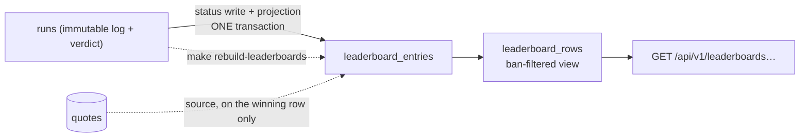

# TypeMore Leaderboards

Bucketed score boards over **accepted** runs (SCORING_CONCEPT §4 and §6,
BACKEND.md §10). A board row is a *projection* of the `runs` table, maintained
inside the replay worker's own transaction, and reproducible from Postgres alone
with `make rebuild-leaderboards`.

There are two kinds: **language boards**, one per (mode, size, language) over
seeded text, and **per-quote boards**, one per quote. A quote run is ranked
inside its quote and nowhere else — the rule, and the three reasons for it, are
under "Quotes rank per quote, and nowhere else".

This phase became possible only once the review policy stopped flagging noise:
under "any plausibility flag ⇒ flagged" 11 of the first 23 runs were in review
and 10 of them were rollover artefacts ([`REPLAY.md`](REPLAY.md), "Review
policy"). A board built on that would have been a board of whoever happened not
to trigger `min-interval`.



## Buckets

There are **two shapes of board**, in one key space:

```
bucket_key = "<mode>:<durationMs|wordCount>:<lang>:<textSource.kind>"   language board
           | "quote:<quoteId>"                                          quote board

time:15000:en:seeded      words:50:ru-RU:seeded      time:60000:code_css:seeded
quote:1f5f1f2c-6f0f-4d5a-9f0a-3f2a1b0c9d8e
```

The key has **exactly one producer**: `leaderboard.Bucket.Key` in
`internal/leaderboard/bucket.go`. Nothing else — no SQL, no handler, no test
fixture — concatenates one, because a second producer is a second board the day
the format grows a component. SQL matches sibling runs on the bucket's
*components* (`quote_id`, `mode`, `duration_ms`, `word_count`, `lang`,
`text_source_kind`) and only ever stores the string Go handed it.
`ParseBucketKey` is the inverse and is what every `{bucket}` path parameter goes
through.

**Mods are not part of either key.** They multiply the score (SCORING_CONCEPT
§2) rather than splitting the board, so a punctuation run and a plain one
compete directly. The entry still records which mods were played, for display.

### How the two shapes share one key space

They are told apart by the literal prefix `quote:`, checked **before** anything
counts components. That works because the first component of a language key is a
**mode**, and the modes are `time` and `words` — the whole list (SCORING_CONCEPT
§4). "quote" is not one and cannot become one by accident: a third ranked mode
is a deliberate change to that list, and this is the line it would have to walk
past. So the prefix is a discriminator, not a convention, and no language key can
grow into a quote key.

The reverse door is shut too. `words:50:en:quote` is **not** a second spelling of
a quote board — it is not a board at all, and `ParseBucketKey` rejects it with the
same `404` an unparseable key gets. `leaderboard_eligible_runs` can never produce
a row for a language cell whose text source is a quote, so a key naming one names
something that cannot exist. One board, one spelling.

A quote key carries **nothing but the id**. Mode, size and language are not
dimensions of a quote board: the quote is a fixed artefact with fixed bytes in one
language, so any second component could only repeat what the id already
determines — and a component that can *disagree* with the id is a way to split one
board into two. Non-canonical uuid spellings (braces, `urn:uuid:`, undashed,
upper case) are rejected for the same reason: they name the same quote but not the
same string, and the string is what the database stores and what people link to.

### Ranked shapes

| Mode | Ranked sizes |
|---|---|
| `time` | 15 000 / 30 000 / 60 000 ms |
| `words` | 25 / 50 / 100 |
| `quote` | *n/a* — every quote is its own board, at whatever length it is |

Everything else — 10 min, 120 s, 10 words, a custom duration — is a perfectly
good run that simply never reaches a board. 10 min is excluded deliberately:
sitting out ten minutes is endurance, and the sample is too small to rank
(SCORING_CONCEPT §4).

Quotes have no size test at all, and could not have one: the corpus runs from 8
to 100+ words, and a quote run carries neither `duration_ms` nor `word_count` to
test ([`RUNS.md`](RUNS.md), "Dimensions"). Its length is a property of the text.

The list lives in the `leaderboard_eligible_runs` view, in one place, read by
both the incremental projection and the rebuild. Widening it is a migration plus
`make rebuild-leaderboards`.

## Eligibility

| Rule | Where it is enforced | Why |
|---|---|---|
| `status = 'accepted'` | `leaderboard_eligible_runs` | Pending has no server numbers; flagged is under review; rejected is an invalid log. |
| **Flags do not disqualify** | — (deliberately absent) | An accepted run that raised a weak signal is accepted. That is the entire point of policy v1; re-excluding flags here would undo it. |
| **A quote run ranks on its quote and nowhere else** | `leaderboard_eligible_runs.quote_id` + `RecomputeLeaderboardCell` | See below. It is the same one column in both directions. |
| A seeded run needs `textSource.kind = 'seeded'` | `leaderboard_eligible_runs` | An absent `textSource` is the legacy shape and means seeded; a run that claims a quote it cannot name lands here and is not seeded, so it ranks nowhere. |
| Ranked mode + size, for seeded runs only | `leaderboard_eligible_runs` | See above. Quotes have no size test and could not have one. |
| Well-formed verdict JSON | `leaderboard_eligible_runs` (`jsonb_typeof` guards) | The view is evaluated inside the worker's transaction; a malformed document must not abort the batch that wrote it. |
| Well-formed quote id | `run_quote_id` (regex guard) | Same reason, one level down: `'q1'::uuid` *raises*, and this view is evaluated inside that same transaction. A quote id that is not a uuid resolves to NULL, not to an aborted batch. |
| Verified email identity | `RecomputeLeaderboardCell` / `EnumerateLeaderboardCells`, per query | Deployment policy, not schema. On by default: an address someone can receive mail at is the cheapest barrier against throwaway accounts that does not punish real players. |
| **Player not banned** | `leaderboard_rows`, at READ time | See below. |

The last two apply to quote boards exactly as they do to language boards — which
is not a thing anyone had to remember, and is the point of them living outside
the eligible view: a new board *shape* cannot escape a filter it never passed
through in the first place (`TestQuoteBoardsHonourBansAndTheEmailGate`).

### Quotes rank per quote, and nowhere else

> **ranked within the quote, unranked globally**

A quote is a fixed map — the direct osu!-beatmap analogue — and everyone who
plays it types the same bytes ([`QUOTES.md`](QUOTES.md)). A score on it means
something next to other scores on that text, and nothing at all next to a seeded
one. SCORING_CONCEPT §6 gives three reasons, and none of them is stylistic:

1. **Memorisation.** A finite corpus of short texts gets farmed by muscle memory;
   the burst it produces is above the player's real speed. Text generated from a
   seed cannot be learned — there is always more of it.
2. **Length variance.** Quotes run 8 to 100+ words. They do not fit the ranked
   sizes, and there is no size they could be filed under honestly.
3. **Cherry-picking.** Let quotes into a global rating and the rating becomes a
   search for easy maps rather than a measure of typing.

#### How the rule is enforced

In **one column**, `leaderboard_eligible_runs.quote_id`, which is non-NULL for
exactly the runs played on a quote. `RecomputeLeaderboardCell` — the only
statement that writes `leaderboard_entries` — matches on it first, and it decides
whether the other coordinates are asked at all:

| Recomputing | The statement asks for | So |
|---|---|---|
| a language cell | `quote_id IS NULL` **and** mode/size/lang/kind | a quote run is not a sibling and cannot enter |
| a quote cell | `quote_id = <that quote>` **and nothing else** | a seeded run is not a sibling and cannot enter; and the mode, size and language the quote was played at are ignored, because they are not dimensions of its board |

Both exclusions are therefore properties of the projection **SQL**, not of Go.
That matters more than it looks: the projection, the rebuild and any future
reader all go through that statement and that view, so neither direction is a
check someone can forget to repeat in a new code path. Go picks *which* cell to
recompute; what may occupy a cell is entirely SQL's answer, so the worst a Go bug
can do is recompute a cell that finds nothing — never file a run into a board the
view would not have put it in.

`TestQuoteRunIsRankedNowhereButItsQuote` asserts the first row over the **whole
entries table and the whole public catalogue**, not over the one language bucket
the run would most plausibly have landed in; `TestSeededRunIsRankedInNoQuoteBoard`
asserts the second.

#### Supersede versus the board

A published quote is **never edited**. Correcting one inserts a new row and
retires the old ([`QUOTES.md`](QUOTES.md), "Immutability"): the revision key is
`(lang, upstream_id, text_hash)` and `InsertQuoteRevision` mints a fresh
`gen_random_uuid()`, so **one id is one text, for the life of the corpus**.

That single fact settles the whole policy, and it is worth stating in both
directions because only one of them is obvious.

**A board is keyed on the quote id — not on `(id, hash)` — and that is already
per-version.** The pair would be redundant: the id determines the hash. A run
that has been ranked stays ranked, against the exact bytes it was played on,
forever; retiring a revision touches neither its `text` nor its board, and
`GET /quotes/{id}` keeps resolving it precisely so that every run on it stays
replayable. A run still *pending* when the corpus moves is ranked normally when
it is judged: the projection resolves the id through `quotes`, and `superseded`
is not part of that join.

**A correction does not reset a board — it forks one.** The corrected text has a
different id, therefore a different and empty board, and players who draw the
quote after the correction rank there. The two populations never merge, and
neither is disturbed. So "fixing a typo does not disturb the board" is true of
the *existing* board and false of the corpus as a whole: the quote the picker
now offers is a different map with a different ranking. If that is not what a
correction should mean, the place to change it is the revision key, not the
board.

`TestSupersedingAQuoteLeavesItsBoardAloneAndOpensANewOne` and
`TestARunJudgedAfterItsQuoteWasRetiredStillRanks` are both halves.

#### Seeded repeats hold no slot

A run whose `setup.adoptedFromRunId` names another run took its **text** from
that run rather than generating it, so the words were knowable before the first
keystroke. Such a run is accepted, judged, stored and listed in its player's own
history — and ranked nowhere, on either board shape.

The exclusion lives in `leaderboard_eligible_runs` beside the quote rule and for
the same reason: one view, so the projection, the rebuild and every read cannot
drift into three answers. It is a property of the RUN, not of the board, which is
why a single line covers a seeded repeat of a language board and of a quote board
alike.

It is **not** a rule about opponents. A pace caret or a ghost drawn over a
FRESHLY generated text changes nothing about the run underneath it: it ranks,
sets a PB and earns TP exactly as it would with an empty field, and losing the
race — on wpm or on score — is not a verdict on anything. See
[`RUNS.md`](RUNS.md), "Text provenance", for why the marker is spelled as the
burden rather than as the permission.

`TestOnlyTheAdoptedTwinIsRankedNowhere` states it as the same run twice, told
apart by that one field; `TestASeededRepeatIsNotPromotedWhenTheSlotEmpties` and
`TestRebuildDoesNotReadmitSeededRepeats` cover the two ways an excluded row
usually creeps back in.

#### TP does not exist yet, and this is the hook it must use

There is no TP (SCORING_CONCEPT §5) in this system today. When it arrives, the
runs it may count are exactly

```sql
SELECT … FROM leaderboard_eligible_runs
```

— the whole view, with **no** extra predicate.

Two things about that are deliberate and both are recent changes of direction, so
read them before writing the query:

**Quote runs DO earn TP.** Earlier revisions of this document and of migration
`00009` said the opposite and told a future implementation to write
`WHERE quote_id IS NULL`; `ARCHITECTURE.md` and SCORING_CONCEPT §6 still carry
the older reasoning (memorisable corpus, length variance, cherry-picking). That
has been overruled as a product decision: **a quote run earns TP exactly as a
seeded run does, with no exception and no coefficient.** The player chooses the
quote, and choosing it — or typing the same one as often as they like — is not
dishonesty. The `quote_id` column stays in the view because it is the board
coordinate; it is no longer a TP filter.

**Seeded repeats do not earn TP,** and they are already excluded by the view, so
this needs no predicate either. That is the whole point of putting the rule in
`leaderboard_eligible_runs` rather than in the projection.

There is deliberately **no** second "TP-eligible runs" view: one more view whose
only difference is a `WHERE` clause is one more thing that can drift from this
one, and the whole design of this table is that eligibility has a single home.

### Why bans are filtered on read, not on write

A ban does not delete anything. The entry stays in `leaderboard_entries` and is
hidden by the `leaderboard_rows` view, which every read goes through — there is
no other way for a query to reach the table. Two consequences worth having:

- **Unbanning is instant.** No rebuild, no re-projection, no lost history.
- **A new endpoint cannot forget the filter**, because the filter is the only
  door.

An expired ban stops hiding immediately (`active_bans` evaluates `expires_at` at
read time), so nothing has to sweep the table.

The `bans` table (BACKEND.md §11) lands in this phase with only the read-side
filter: a leaderboard without ban filtering is not something you can safely
retrofit, while the admin surface that *issues* bans can wait.

## Maintenance

Everything that touches the table is **one statement**,
`RecomputeLeaderboardCell`, whose contract is:

> Set this (player, bucket) cell to the player's best eligible run, or clear it
> if there is none.

Not "upsert if better". The difference is the whole design:

| Event | What the recompute does |
|---|---|
| New personal best | The `ORDER BY` picks the new run. |
| Worse run submitted | The `ORDER BY` keeps the incumbent; `DO UPDATE` no-ops. |
| Equal score | The incumbent wins — ties go to the earlier achievement, and the incumbent is earlier by definition. |
| **Run demoted** (revalidate, moderator) | It drops out of the eligible view and the player's next best run takes the slot. |
| **Demoted run was the only entry** | `best` is empty, so the cell is deleted. |
| Re-promoted | The slot comes back. |

The last two are the cases teams forget. They are not separate code paths here,
which is why they cannot be missing — but they are still tested explicitly
(`TestDemotionPromotesTheNextBestRun`,
`TestDemotingTheOnlyEntryClearsTheCell`).

### When it runs

`internal/replay/pgstore` calls the projector for **every decision it writes**,
inside the transaction that wrote the status:

```
BEGIN
  claim pending/stale runs   FOR UPDATE SKIP LOCKED
  for each run:
    UPDATE runs SET status = …        -- the verdict
    recompute that run's board cell   -- the projection
COMMIT
```

So "accepted" and "on the board" are one atomic fact, and a rollback takes the
projection with it. It runs unconditionally rather than only on a status
*change*: the recompute is idempotent, so running it on an unchanged verdict
costs one statement, while skipping it on a status the worker merely *thinks* is
unchanged is a board that quietly disagrees with the runs table.

`replayctl revalidate` carries the same projector, which is what makes a
policy-driven demotion leave the board in the same transaction.

The hook is `replay/pgstore.Projector`, declared at the consumer and implemented
by `leaderboard/pgstore`. Neither domain imports the other; the composition root
wires them.

### Rebuild

```sh
make rebuild-leaderboards          # go run ./cmd/leaderboardctl rebuild
make leaderboards                  # the board index
make leaderboards bucket=time:15000:en:seeded
make leaderboards bucket=quote:1f5f1f2c-6f0f-4d5a-9f0a-3f2a1b0c9d8e
```

One transaction: count, enumerate every cell with an eligible run, `TRUNCATE`,
then replay each cell through **the same statement** the worker uses.
`TRUNCATE` is transactional in Postgres, so a failed rebuild leaves the old board
intact rather than an empty one.

It is deliberately *not* a bulk `INSERT … SELECT`. That would need SQL to format
bucket keys — a second producer of the key — and would let the two paths disagree
about who owns a slot. Walking cells costs one statement each and makes
"rebuild ≡ incremental" true by construction rather than by two implementations
agreeing.

The enumeration yields candidate **coordinates**, and Go collapses them into the
**boards** they name before walking them. The two are the same thing for a
language board; for a quote board they are not, because the mode and language a
quote was played at ride along in the row and the board ignores them. Collapsing
on `Bucket.Key` — the one producer, again — is what keeps "one cell, one entry"
true and `RebuildStats.Cells` honest.

Run it after:

- flipping `TYPEMORE_LEADERBOARD_REQUIRE_VERIFIED_EMAIL`,
- changing `leaderboard_eligible_runs` (new ranked size, new eligibility rule,
  a quote whose runs were projected before it was resolvable),
- any suspicion that the projection drifted.

A healthy rebuild reports **unchanged**. That it can be run, and that it changes
nothing, is the proof that the board is derived from Postgres and not a second
source of truth.

## Endpoints

All under `/api/v1`, all **public** — a board nobody can read without an account
is a board nobody links to. `/{bucket}/me` is the exception that needs a session,
and it says so itself rather than dragging the others behind middleware.

| Method | Path | Auth | Purpose |
|---|---|---|---|
| GET | `/api/v1/leaderboards` | — | Buckets that hold at least one visible entry, with counts |
| GET | `/api/v1/leaderboards/{bucket}?cursor=&limit=` | — | One page of a ranking |
| GET | `/api/v1/leaderboards/{bucket}/me` | session | The caller's rank and entry, or `204` |
| GET | `/api/v1/runs/{id}/replay` | — | One accepted run's playback metadata |
| GET | `/api/v1/runs/{id}/replay/log` | — | The same run's event log, as stored gzip |

**Quote boards added no route.** `{bucket}` takes `quote:<id>` exactly where it
takes `time:15000:en:seeded`, so paging, `/me`, the cursor, the counted rank and
the `404` for a key that names no board are one implementation rather than two.
That is the payoff for putting quotes in the *same* key space instead of giving
them a parallel `/quote-leaderboards` subtree, and the operator tool is the
observable proof: `make leaderboards bucket=quote:<uuid>` inspects a quote board
today, and `cmd/leaderboardctl` needed **zero lines changed** for it — it prints
`Bucket.Key()` and parses through `ParseBucketKey`, and both already knew. Anything
that "tidies" quote boards into their own namespace pays all of this back.

The session on `/me` is resolved by `auth.OptionalAuth` — it attaches the user
when a cookie is present and never rejects, which is what lets a public subtree
have one personalised route.

### `GET /api/v1/leaderboards`

```json
{ "buckets": [
  { "bucket": "quote:1f5f1f2c-6f0f-4d5a-9f0a-3f2a1b0c9d8e",
    "quoteId": "1f5f1f2c-6f0f-4d5a-9f0a-3f2a1b0c9d8e", "entries": 4 },
  { "bucket": "time:15000:ru-RU:seeded", "mode": "time", "durationMs": 15000,
    "lang": "ru-RU", "textSource": "seeded", "entries": 1 },
  { "bucket": "words:25:ru-RU:seeded", "mode": "words", "wordCount": 25,
    "lang": "ru-RU", "textSource": "seeded", "entries": 2 }
] }
```

| Field | On | Meaning |
|---|---|---|
| `bucket` | both | The key. The only thing a client needs to fetch the board. |
| `quoteId` | quote boards | The quote to resolve through `GET /api/v1/quotes/{id}` for its text and attribution |
| `mode` | language boards | `time` or `words` |
| `durationMs` / `wordCount` | language boards | The dimension, under the name its mode gives it — mutually exclusive |
| `lang` | language boards | The dictionary language |
| `textSource` | language boards | Always `seeded` today |
| `entries` | both | Visible players on the board |

A language board's fields are **absent** on a quote board rather than empty or
zero, because a quote board does not have them: rendering `"mode": ""` would
invite a client to read a mode off a board that has none. The dimension is
rendered under the name its mode gives it, so a client never has to know that
"the number" means milliseconds here and words there.

`entries` is an integer count of the bucket's **visible** rows — the query is
`count(*) … FROM leaderboard_rows GROUP BY bucket_key`, and `leaderboard_rows`
is the ban-filtered view, so a bucket whose only player is banned does not report
one, it disappears (`TestBanHidesTheEntryEverywhereAndKeepsIt`). It is a count of
*players*, not of runs: one slot per player per bucket.

**Quote boards are in here, and they are what stops this response being bounded
by the schema.** Before quotes, the set of possible boards was 2 modes × 3 sizes
× the served languages — a few dozen, forever. There are 9 881 quotes
([`QUOTES.md`](QUOTES.md)), so on a busy corpus this list grows with what people
play. Two things keep that honest for now, and one is deferred:

- empty boards are absent, so the list is bounded by *play*, not by the corpus —
  which is also why "which shapes are ranked is a property of the schema" is no
  longer quite true, and this paragraph replaces it;
- nobody discovers a quote board by browsing this list. You arrive at one from a
  quote you already have an id for, exactly as you arrive at a beatmap leaderboard
  from the beatmap. The index is for the language boards.

Deferred, deliberately: paging or a `?kind=` filter here. The trigger is a real
corpus with real traffic making the response large, not the arithmetic above —
adding a query parameter now would be guessing at which one clients want.

### `GET /api/v1/leaderboards/{bucket}`

```json
{
  "bucket": "words:25:ru-RU:seeded",
  "entries": [
    { "rank": 1, "userId": "245d0902-…", "displayName": "boardsmoke",
      "score": 2864, "wpm": 83.24464940286154, "raw": 83.24464940286154,
      "acc": 1, "grade": "SS",
      "mods": { "punctuation": true, "numbers": false, "randomCase": false,
                "reverse": false, "nospace": false, "difficulty": "normal",
                "minWpm": 0, "blind": false, "fading": false, "flashlight": false },
      "runId": "e865dae0-…", "achievedAt": "2026-07-25T13:43:14.772724Z" }
  ],
  "nextCursor": "Mjg2NDoxNzg0…"
}
```

A quote board's rows are the same shape plus one field:

```json
{
  "bucket": "quote:1f5f1f2c-6f0f-4d5a-9f0a-3f2a1b0c9d8e",
  "entries": [
    { "rank": 1, "userId": "245d0902-…", "displayName": "boardsmoke",
      "score": 3120, "wpm": 91.4, "raw": 92.0, "acc": 1, "grade": "SS",
      "mods": { "…": "…" },
      "source": "Johann Wolfgang von Goethe",
      "runId": "e865dae0-…", "achievedAt": "2026-07-25T13:43:14.772724Z" }
  ]
}
```

**`source` is the quote's attribution, and on a quote board it is not
optional** — a quote is someone's words, and a board that shows the text without
saying whose is not something to ship. It is absent (not empty) on a language
board, where there is no quote to attribute.

It reaches the row as a **snapshot column**, `leaderboard_entries.quote_source`,
not as a join in `leaderboard_rows`. Three reasons, in order of weight:

1. **The language boards must not pay for it.** A board page is one index range
   scan plus the display-name join (`docs/PERFORMANCE.md`, zone 3). A second join
   to `quotes` in the read view would be charged to every page of every language
   board to serve a column that is NULL on all of them.
2. **A published quote is never edited** ([`QUOTES.md`](QUOTES.md),
   "Immutability"), so the snapshot cannot go stale behind the board. That is
   what makes snapshotting *safe* here; it is not safe in general, and it is the
   same argument the score and metric columns already rest on.
3. **It is resolved once, on the write, for the one row that won the cell.**
   `RecomputeLeaderboardCell` does `LEFT JOIN quotes q ON q.id = b.quote_id`
   after the `LIMIT 1` — one primary-key probe per projected entry, on a NULL key
   for a seeded run, which matches nothing and costs nothing. Not once per
   candidate run, and never once per reader.

The join is `LEFT` rather than inner because of the **language** rows, not
because a quote might be missing: a language cell has no quote id at all, and an
inner join would drop every language board's entry. On a quote board the quote
row is guaranteed — `leaderboard_eligible_runs` resolves `quote_id` *through*
`quotes`, so a run is a candidate for a quote cell only if that quote exists.
That is what makes `source` **non-optional** on a quote board rather than merely
usually present.

It is also what keeps the two projection paths agreeing. The per-verdict path
asks `RunBucketCell` which cell a run belongs to and the rebuild enumerates cells
out of the view; both resolve the quote through the same join, so an accepted run
naming a quote that is not in the registry is ranked **nowhere by both**. Before
the view resolved the id (it read it straight out of the setup document), the
rebuild invented a board for such a run and the incremental path did not —
`TestRebuildReproducesIncrementalMaintenance` plants exactly that run and caught
it.

Everything else on a quote board is the same rule as a language board and is not
re-derived for it: ordering, the cursor, and the counted rank all come from the
same three queries against `leaderboard_rows`
(`TestQuoteBoardOrderingAndPaging`).

`limit` defaults to **50**, clamped to **100**. An unparseable bucket key is
`404`; a well-formed but unpopulated one is an empty page.

**`mods` is the RAW verifiable-mods slice of the run's setup, by design.** It is
`run_mods(setup)` — field selection, nothing else — and the client owns what the
combination *means*. There is deliberately no server-side "chips" or display
distillation: that would be a second copy of mod semantics living in SQL and Go,
and keeping it honest would need goja-fenced agreement tests against the vendored
bundle exactly like `grade` has
(`internal/leaderboard/core_agreement_test.go`, `TestGradeMatchesTheCore`). One
such fence exists because `run_grade` must be reproducible from Postgres alone
for the rebuild; a display string has no such requirement, so it does not earn
the second copy. The score column already has the multipliers folded in.

**Ordering:** `score DESC, achieved_at ASC, user_id ASC`. Ties go to whoever got
there first; `user_id` is an arbitrary final tiebreak whose only job is to make
the order *total*, which is what keyset pagination needs to avoid showing the
same player on two pages. All three are in `leaderboard_rank_idx`.

**Cursor:** an opaque base64url token over `(score, achieved_at, user_id)`. The
continuation predicate is spelled out longhand rather than as a row comparison
because the directions are mixed.

**Rank on a continuation page is counted, not carried.** A rank baked into a
token was true when the token was minted and is a lie by the time anyone follows
it; the count is one indexed range scan and is exact.

#### `?around=me` — the window on your own row

```
GET /api/v1/leaderboards/{bucket}?around=me&limit=50
```

The page a "jump to my row" lands on: the caller's entry with its neighbours —
half the limit above, the rest below, and whichever side the board cannot fill
(a caller at rank 1, or at the bottom) spent on the other, so the window is
`limit` rows whenever the board holds that many. The response is the ordinary
page shape plus **`prevCursor`**, the upward continuation token, present
exactly when the window's first row is not rank 1. Needs a session like `/me`,
and answers like it: `401` signed out, **`204`** when the caller holds no
visible slot to centre on (a banned caller included — the same non-answer as
everywhere else). `around`, `cursor` and `before` are mutually exclusive
(`400`): each names one position in the ranking.

```
GET /api/v1/leaderboards/{bucket}?before=<cursor>&limit=50
```

The upward continuation itself, public like the downward one: the rows
strictly outranking the position, nearest the position LAST, so a client
prepends the page verbatim. It carries its own `prevCursor` until the page
reaches rank 1. Ranks on both are counted fresh, exactly like `?cursor=`.

**Cost.** Both sides of the window are start-condition seeks on
`leaderboard_sort_idx` — the rows above are the same seek as the downward
continuation with the btree walked BACKWARD, which is why no second index
exists for this. `TestLoadPlanBoardPageBefore` pins that plan (no seq scan of
the entries table, no sort) the same way the downward page's is pinned, and
`TestAroundWindowAndContinuationsTileTheBoard` holds the seam contract: the
window plus its continuations reproduce the whole board with no duplicate and
no missing row.

There is deliberately **no "next update in" timer** anywhere near this: the
projection is written inside the replay worker's own transaction, so the board
is live by construction and has no refresh cycle a client could count down to.

### `GET /api/v1/leaderboards/{bucket}/me`

`200` with `{ "bucket": …, "entry": { "rank": 7, … } }`, or **`204`** when the
caller holds no visible slot there. `401` without a session; `404` for a bucket
key that cannot name a board.

A banned caller gets `204` — the same answer as someone who never played it. A
board must not leak who is banned, not even to them.

### `GET /api/v1/runs/{id}/replay` and `…/replay/log`

The other half of a watchable board: a row carries a `runId`, and these two
return everything needed to play it back.

**Why two requests.** It used to be one, with the event log inlined as a JSON
field. `docs/PERFORMANCE.md` zone 6 measured what that cost: the stored 373 KiB
gzip blob was gunzipped into a 2.0 MiB `[]byte`, wrapped as a `json.RawMessage`,
and then compacted by `json.NewEncoder` into a third buffer before a byte reached
the socket — **7.5 MiB allocated and 5.5 MiB live per request**, with nothing
written until the whole envelope was assembled. Since the route needs no session
and the rate limit is per IP, four cooperating clients could exhaust a 512 MiB
instance without tripping it. `Content-Encoding: gzip` passthrough was the
cheapest fix on the table (~0.4 MiB) at one price: a gzip stream cannot be a
field inside a JSON object, so the endpoint's **"one request to watch a row"
property was traded for it**. That trade is deliberate and this is what it looks
like.

#### Metadata — `GET /api/v1/runs/{id}/replay`

```json
{
  "runId": "e865dae0-…", "displayName": "boardsmoke",
  "mode": "words", "wordCount": 25, "lang": "ru-RU",
  "seed": 20260724, "dictHash": "804728e8",
  "setup": { "config": {…}, "generation": {…}, "declaration": {…} },
  "serverMetrics": { "wpm": 83.24, "raw": 83.24, "accuracy": 1, "…": "…" },
  "serverScore": { "version": 2, "total": 2864, "…": "…" },
  "grade": "SS", "achievedAt": "2026-07-25T13:43:14.772724Z"
}
```

`durationMs` and `wordCount` are mutually exclusive — the run carries whichever
its mode gives it, and the other is absent. A **quote run carries neither**
(`"mode": "quote"`), because its length is a property of the text
([`RUNS.md`](RUNS.md), "Dimensions"). There is **no `log` field**.

**There is no word list either, and that is the point of `seed` + `dictHash`.**
The client regenerates the exact text with the core's own generator from the seed
and `setup.generation`, after checking that the dictionary it holds hashes to
`dictHash` — the same check the live match path makes before it trusts a
regenerated word. Serialising the words instead would put a second copy of the
generator's output on the wire for the server to keep in step with the core, and
it is the same principle as the `mods` note above: the client owns the semantics.
Both fields are already on the owner's authenticated summary
([`RUNS.md`](RUNS.md)), so exposing them here is reach, not disclosure.

It carries the verdict's *result*, never its reasoning: no `validation`, no
`clientScore`, no `clientMetrics`. A spectator has no business reading the
moderation trail.

#### Watching a quote run

**The shape is unchanged and needed no quote discriminator added to it**, because
it already carries one. Verified against both queries: a quote run comes back
from this route like any other, with

```json
{
  "mode": "quote", "lang": "english",
  "seed": 20260724, "dictHash": "8b1cf30a",
  "setup": { "generation": { "…": "…",
    "textSource": { "kind": "quote", "quoteId": "1f5f1f2c-…", "quoteHash": "8b1cf30a" } } }
}
```

and no `durationMs` or `wordCount`. The discriminator a client needs is
`setup.generation.textSource.kind === "quote"`, which is *the same field the
server itself branches on* — the eligible view reads exactly this document. A
second, top-level copy of the same fact would be a second thing to keep true.

Two details that look wrong until you know why:

- **`dictHash` on a quote run is not a dictionary hash.** It is
  `dictVersion([text])` — the quote's `text_hash`, byte for byte the value the
  registry stores ([`QUOTES.md`](QUOTES.md)), because the core computes a quote
  run's `SeedContext.dictVersion` from the text instead of from a word list. It
  will not resolve against the dictionary registry, and it is not supposed to:
  the client fetches `GET /api/v1/quotes/{quoteId}` and checks *that* `textHash`
  against it. Same verification, same field, different corpus.
- **`quoteHash` and `dictHash` are therefore the same string.** That looks
  redundant and is not: one is the hash the client *claimed* when it submitted
  the run and lives inside the immutable setup snapshot; the other is the hash
  the run was actually judged against. Watching them agree is the check.

`seed` is still there and still meaningless for a quote — `generateWords` splits
the text on spaces and consumes no PRNG — but it is a column on every run and
omitting it here would make the envelope's shape depend on the text source for no
gain.

#### Log — `GET /api/v1/runs/{id}/replay/log`

The body is **the stored gzip bytes, verbatim** — the blob ingestion wrote,
neither decompressed nor re-compressed on the way out — served as:

| Header | Value |
|---|---|
| `Content-Type` | `application/json` |
| `Content-Encoding` | `gzip` |
| `Content-Length` | the length of the **compressed** bytes |
| `Cache-Control` | `public, max-age=31536000, immutable` |
| `ETag` | `"<run id>"` (strong) |

**Callers see plain JSON.** `Content-Encoding` describes how the representation
arrived, `Content-Type` describes what it is once decoded; browsers, `fetch`,
Go's `http.Transport` and `curl --compressed` all decompress it transparently and
hand over the same `{ "version": 1, "events": [ … ] }` the inlined field used to
carry. **There is no base64 anywhere** — the bytes are binary on the wire, which
is exactly why they are ~5× smaller than the JSON they decode to.

There is no `Vary: Accept-Encoding`. The dictionary asset routes need it because
they choose between two representations; this route has exactly one, always gzip,
so claiming the response varies would be false.

**Immutable, keyed by run id.** A run's log is written once at ingestion and
never updated — revalidation moves only the verdict columns — so the id alone
identifies the bytes forever. A conditional request with a matching
`If-None-Match` gets **`304`** with no body; a stale validator gets the full
response again. The 404 rules below are evaluated *before* the conditional check,
so a run the caller may not watch is never told "not modified".

#### Shared access matrix

Every failure is the same `404`, on **both** routes — a spectator must not be
able to tell "under review" from "never existed", nor learn it from whichever
route was left behind:

| Run | Response |
|---|---|
| accepted, owner not banned | `200` |
| flagged | `404` |
| rejected | `404` |
| pending | `404` |
| accepted, owner banned | `404` |
| nonexistent / not a uuid | `404` |

All three rules live in the `WHERE` clause of both queries — the same three
predicates, spelled the same way, join to `users` included — so no caller can
reach the data without them and the pair cannot drift into two access matrices.
The owner gets the same public answer here; their own runs stay reachable at any
status through the authenticated `GET /runs/{id}?log=1`, which is untouched.

**Rate limited per IP** (default: burst 30, one token every 2 s), and **the two
routes share one bucket**. Splitting the payload must not double what an
anonymous IP may command, so each route spends a token from the same bucket: a
spectator pays two tokens per run watched, making the default burst 15 runs
rather than 30. The memory that burst can command went *down* — the metadata
envelope is kilobytes and the log is passthrough.

## Schema

```
bans
  user_id    uuid pk → users ON DELETE CASCADE
  reason     text
  issued_by  uuid → users ON DELETE SET NULL   -- losing the moderator must not drop the ban
  issued_at  timestamptz
  expires_at timestamptz NULL                  -- NULL = permanent

leaderboard_entries
  bucket_key   text          -- formatted by leaderboard.Bucket.Key, nothing else
  user_id      uuid → users ON DELETE CASCADE
  run_id       uuid → runs  ON DELETE CASCADE
  score        bigint        -- the SERVER's score
  wpm/raw/acc  numeric       -- the SERVER's metrics
  grade        text          -- run_grade(acc)
  mods         jsonb         -- run_mods(setup)
  quote_source text NULL     -- quotes.source, on quote boards only
  achieved_at  timestamptz   -- runs.created_at: when it was PLAYED, not projected
  PRIMARY KEY (bucket_key, user_id)                                  -- one slot per player per bucket
  idx (bucket_key, score DESC, achieved_at ASC, user_id ASC)         -- the ranking scan
  unique idx (run_id)                                                -- a run holds at most one slot
```

There is deliberately **no `quote_id` column**: the bucket key already carries it,
and a second copy is a second thing that can disagree with the first. Nothing in
SQL needs to know which board a row belongs to — SQL never parses a bucket key —
so the column would exist only to be denormalised.

The columns are a **snapshot** of the run, not a join to it: a page is one index
range scan plus the display-name join, and a run that later loses its accepted
status is *removed* by the projection rather than silently changing what the
board shows.

`unique (run_id)` is implied — a run belongs to one player and one bucket — and
is there so a projection bug fails loudly instead of duplicating a player across
boards. It has already earned its keep once, in a test.

### Derivations, and where they live

These SQL objects exist so that "eligible" and "visible" cannot drift between the
projection, the rebuild and the reads:

| Object | Answers |
|---|---|
| `run_grade(numeric)` | The letter grade of an accuracy |
| `run_text_source_kind(jsonb)` | Where a run's text came from |
| `run_quote_id(jsonb)` | Which quote a run was played on, if any |
| `run_mods(jsonb)` | Which mod flags a run was played under |
| `active_bans` | Which bans are in force right now |
| `leaderboard_eligible_runs` | Which runs may hold a slot, and in which cell |
| `leaderboard_rows` | Which entries a reader may see |

**`run_grade` mirrors the core's `gradeOf`** (`shared/core/score.ts`), and that
duplication is fenced rather than trusted: `TestGradeMatchesTheCore` drives the
*real vendored bundle* in goja across every threshold boundary and compares it
against the SQL function. Move a threshold in the core and CI goes red instead of
the boards going quietly wrong.

It is in SQL rather than Go because the requirement is that the projection be
reproducible from Postgres alone — the rebuild must not need a JS interpreter to
grade a run it is re-deriving.

**`run_mods` is field selection, not scoring.** The multipliers and the "which
combination counts as what" logic stay in the core; the score column already has
them folded in. `TestModsProjectionCoversEveryCoreMod` reads `MOD_MULTIPLIERS`
out of the bundle and asserts every mod the core knows about has a field here.

**`run_text_source_kind` defaults an absent `textSource` to `seeded`.** An absent
field is the legacy shape — every run written before quotes existed has no
`textSource` at all, and keeping that shape valid is what holds
`EVENT_LOG_VERSION` at 1 — so "missing" and `'seeded'` must mean the same thing
everywhere. The default is safe rather than trusting, because a run whose text
did not come from the seed cannot survive replay in the first place: the worker
regenerates the words from seed + dictionary before judging the log.

**`run_quote_id` returns the quote id or NULL, and guards the cast.** It requires
`textSource.kind = 'quote'` *and* a syntactically valid uuid before casting,
because `'q1'::uuid` raises rather than returning NULL and this function is
evaluated inside the replay worker's verdict transaction — one hand-edited setup
document must not be able to abort the batch that wrote it. The ingest validator
already rejects a malformed quote id with a `422` ([`RUNS.md`](RUNS.md)); this is
the guard for everything that did not come through it.

A run whose quote id resolves to nothing is ranked **nowhere**: it fails the quote
branch (there is no quote) and the seeded branch (its text source is not
`seeded`). Failing closed is the only safe direction — the alternatives are a
board on a text nobody can fetch, or a quote score in the global ranking.

## Why no Redis

BACKEND.md §0 and §10 pencilled in a Redis ZSET as the leaderboard read model.
**This phase does not use it**, and that is a deliberate deviation.

A board page is one index range scan over `leaderboard_rank_idx` plus a join to
`users`. At this scale — and at a hundred times this scale — Postgres answers it
in under a millisecond. Adding Redis now would buy nothing and cost:

- a second source of truth to keep in sync with the verdict transaction (the
  ZSET update cannot join the Postgres transaction, so "accepted" and "ranked"
  stop being one atomic fact);
- a rebuild path that has to reconcile two stores rather than one;
- an operational dependency on the critical read path.

The principle from BACKEND.md §3 is kept exactly: **Postgres is the source of
truth, the read model is rebuildable.** It is simply rebuildable *into
Postgres* for now.

Nothing is painted into a corner. Reads go through the `leaderboard.Store`
interface (`internal/leaderboard/store.go`), declared at the consumer; a ZSET
implementation slots in behind it without touching a handler, and
`make rebuild-leaderboards` is already the "repopulate the read model" command it
would need. The trigger to do it is a measured one — board reads dominating the
database, or ranking latency showing up in traces — not a diagram.

## Environment

| Variable | Default | Meaning |
|---|---|---|
| `TYPEMORE_LEADERBOARD_REQUIRE_VERIFIED_EMAIL` | `true` | Require a verified email identity to hold a board slot. Takes effect on already-judged runs only after `make rebuild-leaderboards`. |
| `TYPEMORE_LEADERBOARD_REPLAY_RATE_EVERY` | `2s` | Per-IP refill interval for the public replay pair |
| `TYPEMORE_LEADERBOARD_REPLAY_RATE_BURST` | `30` | Per-IP bucket size for the same. ONE bucket across both `/replay` and `/replay/log`, so a watch costs two tokens |

## Deliberately deferred

- **WPM boards** alongside score boards (SCORING_CONCEPT §4). The projection is
  already ordered by `score`; a parallel WPM ranking is a second index and a
  second ordering, not a new pipeline.
- **TP / profile rating** (SCORING_CONCEPT §5) — its own phase, its own formula,
  deliberately not derived from `score`. When it lands it counts
  `leaderboard_eligible_runs WHERE quote_id IS NULL`; see "Quotes rank per quote,
  and nowhere else".
- **Daily challenge boards** (one seed for everyone) — needs the scheduler. A
  daily challenge may itself be a quote, which is why a quote board is a board
  and not a special case bolted onto the language ones.
- **A "Quotes TP"** (SCORING_CONCEPT §6, "far beyond MVP") — a rating computed
  *within* the corpus, where memorisation is the game rather than a leak. It
  needs its own formula for the same reason TP does, and nothing here blocks it.
- **Star rating per quote** (SCORING_CONCEPT §6) — the same analyser the seeded
  texts will use. A quote board ranks by score today, and score has no
  `textDifficulty` factor yet for either text source.
- **Paging or filtering the board index.** Quote boards make it grow with play
  rather than with the schema; see `GET /api/v1/leaderboards`.
- **The admin surface that issues bans.** The table and the read filter are here;
  the moderation UI is BACKEND.md §11.
- **Jump to page N.** It needs an offset scan, and nobody has asked for it.
  "Around my rank" left this list: `?around=me` serves it as two keyset seeks
  on the existing index (see the endpoint above).
