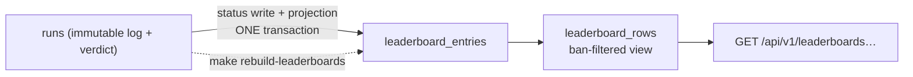

# TypeMore Leaderboards

Bucketed score boards over **accepted** runs (SCORING_CONCEPT §4, BACKEND.md §10).
A board row is a *projection* of the `runs` table, maintained inside the replay
worker's own transaction, and reproducible from Postgres alone with
`make rebuild-leaderboards`.

This phase became possible only once the review policy stopped flagging noise:
under "any plausibility flag ⇒ flagged" 11 of the first 23 runs were in review
and 10 of them were rollover artefacts ([`REPLAY.md`](REPLAY.md), "Review
policy"). A board built on that would have been a board of whoever happened not
to trigger `min-interval`.



## Buckets

```
bucket_key = "<mode>:<durationMs|wordCount>:<lang>:<textSource.kind>"

time:15000:en:seeded      words:50:ru-RU:seeded      time:60000:css_code:seeded
```

The key has **exactly one producer**: `leaderboard.Bucket.Key` in
`internal/leaderboard/bucket.go`. Nothing else — no SQL, no handler, no test
fixture — concatenates one, because a second producer is a second board the day
the format grows a component. SQL matches sibling runs on the bucket's
*components* (`mode`, `duration_ms`, `word_count`, `lang`, `text_source_kind`)
and only ever stores the string Go handed it. `ParseBucketKey` is the inverse and
is what every `{bucket}` path parameter goes through.

**Mods are not part of the key.** They multiply the score (SCORING_CONCEPT §2)
rather than splitting the board, so a punctuation run and a plain one compete
directly. The entry still records which mods were played, for display.

### Ranked shapes

| Mode | Ranked sizes |
|---|---|
| `time` | 15 000 / 30 000 / 60 000 ms |
| `words` | 25 / 50 / 100 |

Everything else — 10 min, 120 s, 10 words, a custom duration — is a perfectly
good run that simply never reaches a board. 10 min is excluded deliberately:
sitting out ten minutes is endurance, and the sample is too small to rank
(SCORING_CONCEPT §4).

The list lives in the `leaderboard_eligible_runs` view, in one place, read by
both the incremental projection and the rebuild. Widening it is a migration plus
`make rebuild-leaderboards`.

## Eligibility

| Rule | Where it is enforced | Why |
|---|---|---|
| `status = 'accepted'` | `leaderboard_eligible_runs` | Pending has no server numbers; flagged is under review; rejected is an invalid log. |
| **Flags do not disqualify** | — (deliberately absent) | An accepted run that raised a weak signal is accepted. That is the entire point of policy v1; re-excluding flags here would undo it. |
| `textSource.kind = 'seeded'` | `leaderboard_eligible_runs` | Quotes are a finite, memorisable corpus: they rank per quote, never globally (SCORING_CONCEPT §6). |
| Ranked mode + size | `leaderboard_eligible_runs` | See above. |
| Well-formed verdict JSON | `leaderboard_eligible_runs` (`jsonb_typeof` guards) | The view is evaluated inside the worker's transaction; a malformed document must not abort the batch that wrote it. |
| Verified email identity | `RecomputeLeaderboardCell` / `EnumerateLeaderboardCells`, per query | Deployment policy, not schema. On by default: an address someone can receive mail at is the cheapest barrier against throwaway accounts that does not punish real players. |
| **Player not banned** | `leaderboard_rows`, at READ time | See below. |

### Why bans are filtered on read, not on write

A ban does not delete anything. The entry stays in `leaderboard_entries` and is
hidden by the `leaderboard_rows` view, which every read goes through — there is
no other way for a query to reach the table. Two consequences worth having:

- **Unbanning is instant.** No rebuild, no re-projection, no lost history.
- **A new endpoint cannot forget the filter**, because the filter is the only
  door.

An expired ban stops hiding immediately (`active_bans` evaluates `expires_at` at
read time), so nothing has to sweep the table.

The `bans` table (BACKEND.md §11) lands in this phase with only the read-side
filter: a leaderboard without ban filtering is not something you can safely
retrofit, while the admin surface that *issues* bans can wait.

## Maintenance

Everything that touches the table is **one statement**,
`RecomputeLeaderboardCell`, whose contract is:

> Set this (player, bucket) cell to the player's best eligible run, or clear it
> if there is none.

Not "upsert if better". The difference is the whole design:

| Event | What the recompute does |
|---|---|
| New personal best | The `ORDER BY` picks the new run. |
| Worse run submitted | The `ORDER BY` keeps the incumbent; `DO UPDATE` no-ops. |
| Equal score | The incumbent wins — ties go to the earlier achievement, and the incumbent is earlier by definition. |
| **Run demoted** (revalidate, moderator) | It drops out of the eligible view and the player's next best run takes the slot. |
| **Demoted run was the only entry** | `best` is empty, so the cell is deleted. |
| Re-promoted | The slot comes back. |

The last two are the cases teams forget. They are not separate code paths here,
which is why they cannot be missing — but they are still tested explicitly
(`TestDemotionPromotesTheNextBestRun`,
`TestDemotingTheOnlyEntryClearsTheCell`).

### When it runs

`internal/replay/pgstore` calls the projector for **every decision it writes**,
inside the transaction that wrote the status:

```
BEGIN
  claim pending/stale runs   FOR UPDATE SKIP LOCKED
  for each run:
    UPDATE runs SET status = …        -- the verdict
    recompute that run's board cell   -- the projection
COMMIT
```

So "accepted" and "on the board" are one atomic fact, and a rollback takes the
projection with it. It runs unconditionally rather than only on a status
*change*: the recompute is idempotent, so running it on an unchanged verdict
costs one statement, while skipping it on a status the worker merely *thinks* is
unchanged is a board that quietly disagrees with the runs table.

`replayctl revalidate` carries the same projector, which is what makes a
policy-driven demotion leave the board in the same transaction.

The hook is `replay/pgstore.Projector`, declared at the consumer and implemented
by `leaderboard/pgstore`. Neither domain imports the other; the composition root
wires them.

### Rebuild

```sh
make rebuild-leaderboards          # go run ./cmd/leaderboardctl rebuild
make leaderboards                  # the board index
make leaderboards bucket=time:15000:en:seeded
```

One transaction: count, enumerate every cell with an eligible run, `TRUNCATE`,
then replay each cell through **the same statement** the worker uses.
`TRUNCATE` is transactional in Postgres, so a failed rebuild leaves the old board
intact rather than an empty one.

It is deliberately *not* a bulk `INSERT … SELECT`. That would need SQL to format
bucket keys — a second producer of the key — and would let the two paths disagree
about who owns a slot. Walking cells costs one statement each and makes
"rebuild ≡ incremental" true by construction rather than by two implementations
agreeing.

Run it after:

- flipping `TYPEMORE_LEADERBOARD_REQUIRE_VERIFIED_EMAIL`,
- changing `leaderboard_eligible_runs` (new ranked size, new eligibility rule),
- any suspicion that the projection drifted.

A healthy rebuild reports **unchanged**. That it can be run, and that it changes
nothing, is the proof that the board is derived from Postgres and not a second
source of truth.

## Endpoints

All under `/api/v1`, all **public** — a board nobody can read without an account
is a board nobody links to. `/{bucket}/me` is the exception that needs a session,
and it says so itself rather than dragging the others behind middleware.

| Method | Path | Auth | Purpose |
|---|---|---|---|
| GET | `/api/v1/leaderboards` | — | Buckets that hold at least one visible entry, with counts |
| GET | `/api/v1/leaderboards/{bucket}?cursor=&limit=` | — | One page of a ranking |
| GET | `/api/v1/leaderboards/{bucket}/me` | session | The caller's rank and entry, or `204` |
| GET | `/api/v1/runs/{id}/replay` | — | One accepted run's playback metadata |
| GET | `/api/v1/runs/{id}/replay/log` | — | The same run's event log, as stored gzip |

The session on `/me` is resolved by `auth.OptionalAuth` — it attaches the user
when a cookie is present and never rejects, which is what lets a public subtree
have one personalised route.

### `GET /api/v1/leaderboards`

```json
{ "buckets": [
  { "bucket": "time:15000:ru-RU:seeded", "mode": "time", "durationMs": 15000,
    "lang": "ru-RU", "textSource": "seeded", "entries": 1 },
  { "bucket": "words:25:ru-RU:seeded", "mode": "words", "wordCount": 25,
    "lang": "ru-RU", "textSource": "seeded", "entries": 2 }
] }
```

The dimension is rendered under the name its mode gives it, so a client never has
to know that "the number" means milliseconds here and words there. Empty buckets
are absent rather than enumerated: which shapes are ranked is a property of the
schema, and a board with nothing in it is not news.

`entries` is an integer count of the bucket's **visible** rows — the query is
`count(*) … FROM leaderboard_rows GROUP BY bucket_key`, and `leaderboard_rows`
is the ban-filtered view, so a bucket whose only player is banned does not report
one, it disappears (`TestBanHidesTheEntryEverywhereAndKeepsIt`). It is a count of
*players*, not of runs: one slot per player per bucket.

### `GET /api/v1/leaderboards/{bucket}`

```json
{
  "bucket": "words:25:ru-RU:seeded",
  "entries": [
    { "rank": 1, "userId": "245d0902-…", "displayName": "boardsmoke",
      "score": 2864, "wpm": 83.24464940286154, "raw": 83.24464940286154,
      "acc": 1, "grade": "SS",
      "mods": { "punctuation": true, "numbers": false, "randomCase": false,
                "reverse": false, "nospace": false, "difficulty": "normal",
                "minWpm": 0, "blind": false, "fading": false, "flashlight": false },
      "runId": "e865dae0-…", "achievedAt": "2026-07-25T13:43:14.772724Z" }
  ],
  "nextCursor": "Mjg2NDoxNzg0…"
}
```

`limit` defaults to **50**, clamped to **100**. An unparseable bucket key is
`404`; a well-formed but unpopulated one is an empty page.

**`mods` is the RAW verifiable-mods slice of the run's setup, by design.** It is
`run_mods(setup)` — field selection, nothing else — and the client owns what the
combination *means*. There is deliberately no server-side "chips" or display
distillation: that would be a second copy of mod semantics living in SQL and Go,
and keeping it honest would need goja-fenced agreement tests against the vendored
bundle exactly like `grade` has
(`internal/leaderboard/core_agreement_test.go`, `TestGradeMatchesTheCore`). One
such fence exists because `run_grade` must be reproducible from Postgres alone
for the rebuild; a display string has no such requirement, so it does not earn
the second copy. The score column already has the multipliers folded in.

**Ordering:** `score DESC, achieved_at ASC, user_id ASC`. Ties go to whoever got
there first; `user_id` is an arbitrary final tiebreak whose only job is to make
the order *total*, which is what keyset pagination needs to avoid showing the
same player on two pages. All three are in `leaderboard_rank_idx`.

**Cursor:** an opaque base64url token over `(score, achieved_at, user_id)`. The
continuation predicate is spelled out longhand rather than as a row comparison
because the directions are mixed.

**Rank on a continuation page is counted, not carried.** A rank baked into a
token was true when the token was minted and is a lie by the time anyone follows
it; the count is one indexed range scan and is exact.

### `GET /api/v1/leaderboards/{bucket}/me`

`200` with `{ "bucket": …, "entry": { "rank": 7, … } }`, or **`204`** when the
caller holds no visible slot there. `401` without a session; `404` for a bucket
key that cannot name a board.

A banned caller gets `204` — the same answer as someone who never played it. A
board must not leak who is banned, not even to them.

### `GET /api/v1/runs/{id}/replay` and `…/replay/log`

The other half of a watchable board: a row carries a `runId`, and these two
return everything needed to play it back.

**Why two requests.** It used to be one, with the event log inlined as a JSON
field. `docs/PERFORMANCE.md` zone 6 measured what that cost: the stored 373 KiB
gzip blob was gunzipped into a 2.0 MiB `[]byte`, wrapped as a `json.RawMessage`,
and then compacted by `json.NewEncoder` into a third buffer before a byte reached
the socket — **7.5 MiB allocated and 5.5 MiB live per request**, with nothing
written until the whole envelope was assembled. Since the route needs no session
and the rate limit is per IP, four cooperating clients could exhaust a 512 MiB
instance without tripping it. `Content-Encoding: gzip` passthrough was the
cheapest fix on the table (~0.4 MiB) at one price: a gzip stream cannot be a
field inside a JSON object, so the endpoint's **"one request to watch a row"
property was traded for it**. That trade is deliberate and this is what it looks
like.

#### Metadata — `GET /api/v1/runs/{id}/replay`

```json
{
  "runId": "e865dae0-…", "displayName": "boardsmoke",
  "mode": "words", "wordCount": 25, "lang": "ru-RU",
  "seed": 20260724, "dictHash": "804728e8",
  "setup": { "config": {…}, "generation": {…}, "declaration": {…} },
  "serverMetrics": { "wpm": 83.24, "raw": 83.24, "accuracy": 1, "…": "…" },
  "serverScore": { "version": 2, "total": 2864, "…": "…" },
  "grade": "SS", "achievedAt": "2026-07-25T13:43:14.772724Z"
}
```

`durationMs` and `wordCount` are mutually exclusive — the run carries whichever
its mode gives it, and the other is absent. There is **no `log` field**.

**There is no word list either, and that is the point of `seed` + `dictHash`.**
The client regenerates the exact text with the core's own generator from the seed
and `setup.generation`, after checking that the dictionary it holds hashes to
`dictHash` — the same check the live match path makes before it trusts a
regenerated word. Serialising the words instead would put a second copy of the
generator's output on the wire for the server to keep in step with the core, and
it is the same principle as the `mods` note above: the client owns the semantics.
Both fields are already on the owner's authenticated summary
([`RUNS.md`](RUNS.md)), so exposing them here is reach, not disclosure.

It carries the verdict's *result*, never its reasoning: no `validation`, no
`clientScore`, no `clientMetrics`. A spectator has no business reading the
moderation trail.

#### Log — `GET /api/v1/runs/{id}/replay/log`

The body is **the stored gzip bytes, verbatim** — the blob ingestion wrote,
neither decompressed nor re-compressed on the way out — served as:

| Header | Value |
|---|---|
| `Content-Type` | `application/json` |
| `Content-Encoding` | `gzip` |
| `Content-Length` | the length of the **compressed** bytes |
| `Cache-Control` | `public, max-age=31536000, immutable` |
| `ETag` | `"<run id>"` (strong) |

**Callers see plain JSON.** `Content-Encoding` describes how the representation
arrived, `Content-Type` describes what it is once decoded; browsers, `fetch`,
Go's `http.Transport` and `curl --compressed` all decompress it transparently and
hand over the same `{ "version": 1, "events": [ … ] }` the inlined field used to
carry. **There is no base64 anywhere** — the bytes are binary on the wire, which
is exactly why they are ~5× smaller than the JSON they decode to.

There is no `Vary: Accept-Encoding`. The dictionary asset routes need it because
they choose between two representations; this route has exactly one, always gzip,
so claiming the response varies would be false.

**Immutable, keyed by run id.** A run's log is written once at ingestion and
never updated — revalidation moves only the verdict columns — so the id alone
identifies the bytes forever. A conditional request with a matching
`If-None-Match` gets **`304`** with no body; a stale validator gets the full
response again. The 404 rules below are evaluated *before* the conditional check,
so a run the caller may not watch is never told "not modified".

#### Shared access matrix

Every failure is the same `404`, on **both** routes — a spectator must not be
able to tell "under review" from "never existed", nor learn it from whichever
route was left behind:

| Run | Response |
|---|---|
| accepted, owner not banned | `200` |
| flagged | `404` |
| rejected | `404` |
| pending | `404` |
| accepted, owner banned | `404` |
| nonexistent / not a uuid | `404` |

All three rules live in the `WHERE` clause of both queries — the same three
predicates, spelled the same way, join to `users` included — so no caller can
reach the data without them and the pair cannot drift into two access matrices.
The owner gets the same public answer here; their own runs stay reachable at any
status through the authenticated `GET /runs/{id}?log=1`, which is untouched.

**Rate limited per IP** (default: burst 30, one token every 2 s), and **the two
routes share one bucket**. Splitting the payload must not double what an
anonymous IP may command, so each route spends a token from the same bucket: a
spectator pays two tokens per run watched, making the default burst 15 runs
rather than 30. The memory that burst can command went *down* — the metadata
envelope is kilobytes and the log is passthrough.

## Schema

```
bans
  user_id    uuid pk → users ON DELETE CASCADE
  reason     text
  issued_by  uuid → users ON DELETE SET NULL   -- losing the moderator must not drop the ban
  issued_at  timestamptz
  expires_at timestamptz NULL                  -- NULL = permanent

leaderboard_entries
  bucket_key  text          -- formatted by leaderboard.Bucket.Key, nothing else
  user_id     uuid → users ON DELETE CASCADE
  run_id      uuid → runs  ON DELETE CASCADE
  score       bigint        -- the SERVER's score
  wpm/raw/acc numeric       -- the SERVER's metrics
  grade       text          -- run_grade(acc)
  mods        jsonb         -- run_mods(setup)
  achieved_at timestamptz   -- runs.created_at: when it was PLAYED, not projected
  PRIMARY KEY (bucket_key, user_id)                                  -- one slot per player per bucket
  idx (bucket_key, score DESC, achieved_at ASC, user_id ASC)         -- the ranking scan
  unique idx (run_id)                                                -- a run holds at most one slot
```

The columns are a **snapshot** of the run, not a join to it: a page is one index
range scan plus the display-name join, and a run that later loses its accepted
status is *removed* by the projection rather than silently changing what the
board shows.

`unique (run_id)` is implied — a run belongs to one player and one bucket — and
is there so a projection bug fails loudly instead of duplicating a player across
boards. It has already earned its keep once, in a test.

### Derivations, and where they live

Four SQL objects exist so that "eligible" and "visible" cannot drift between the
projection, the rebuild and the reads:

| Object | Answers |
|---|---|
| `run_grade(numeric)` | The letter grade of an accuracy |
| `run_text_source_kind(jsonb)` | Where a run's text came from |
| `run_mods(jsonb)` | Which mod flags a run was played under |
| `active_bans` | Which bans are in force right now |
| `leaderboard_eligible_runs` | Which runs may hold a slot |
| `leaderboard_rows` | Which entries a reader may see |

**`run_grade` mirrors the core's `gradeOf`** (`shared/core/score.ts`), and that
duplication is fenced rather than trusted: `TestGradeMatchesTheCore` drives the
*real vendored bundle* in goja across every threshold boundary and compares it
against the SQL function. Move a threshold in the core and CI goes red instead of
the boards going quietly wrong.

It is in SQL rather than Go because the requirement is that the projection be
reproducible from Postgres alone — the rebuild must not need a JS interpreter to
grade a run it is re-deriving.

**`run_mods` is field selection, not scoring.** The multipliers and the "which
combination counts as what" logic stay in the core; the score column already has
them folded in. `TestModsProjectionCoversEveryCoreMod` reads `MOD_MULTIPLIERS`
out of the bundle and asserts every mod the core knows about has a field here.

**`run_text_source_kind` defaults an absent `textSource` to `seeded`.** Today's
client generates every text from the seed and sends no such field; BACKEND.md §8's
`seeded|fixed` abstraction will populate it when quotes land. The default is safe
rather than trusting, because a run whose text did not come from the seed cannot
survive replay in the first place: the worker regenerates the words from
seed + dictionary before judging the log.

## Why no Redis

BACKEND.md §0 and §10 pencilled in a Redis ZSET as the leaderboard read model.
**This phase does not use it**, and that is a deliberate deviation.

A board page is one index range scan over `leaderboard_rank_idx` plus a join to
`users`. At this scale — and at a hundred times this scale — Postgres answers it
in under a millisecond. Adding Redis now would buy nothing and cost:

- a second source of truth to keep in sync with the verdict transaction (the
  ZSET update cannot join the Postgres transaction, so "accepted" and "ranked"
  stop being one atomic fact);
- a rebuild path that has to reconcile two stores rather than one;
- an operational dependency on the critical read path.

The principle from BACKEND.md §3 is kept exactly: **Postgres is the source of
truth, the read model is rebuildable.** It is simply rebuildable *into
Postgres* for now.

Nothing is painted into a corner. Reads go through the `leaderboard.Store`
interface (`internal/leaderboard/store.go`), declared at the consumer; a ZSET
implementation slots in behind it without touching a handler, and
`make rebuild-leaderboards` is already the "repopulate the read model" command it
would need. The trigger to do it is a measured one — board reads dominating the
database, or ranking latency showing up in traces — not a diagram.

## Environment

| Variable | Default | Meaning |
|---|---|---|
| `TYPEMORE_LEADERBOARD_REQUIRE_VERIFIED_EMAIL` | `true` | Require a verified email identity to hold a board slot. Takes effect on already-judged runs only after `make rebuild-leaderboards`. |
| `TYPEMORE_LEADERBOARD_REPLAY_RATE_EVERY` | `2s` | Per-IP refill interval for the public replay pair |
| `TYPEMORE_LEADERBOARD_REPLAY_RATE_BURST` | `30` | Per-IP bucket size for the same. ONE bucket across both `/replay` and `/replay/log`, so a watch costs two tokens |

## Deliberately deferred

- **WPM boards** alongside score boards (SCORING_CONCEPT §4). The projection is
  already ordered by `score`; a parallel WPM ranking is a second index and a
  second ordering, not a new pipeline.
- **TP / profile rating** (SCORING_CONCEPT §5) — its own phase, its own formula,
  deliberately not derived from `score`.
- **Daily challenge boards** (one seed for everyone) — needs the scheduler.
- **Per-quote boards** (SCORING_CONCEPT §6) — the `textSource` kind is already in
  the bucket key so they land additively, as `words:*:*:quote`-shaped boards or
  their own key space.
- **The admin surface that issues bans.** The table and the read filter are here;
  the moderation UI is BACKEND.md §11.
- **Pagination beyond keyset** (jump to page N, "around my rank"). Both need an
  offset or a windowed rank query; neither is asked for yet.
