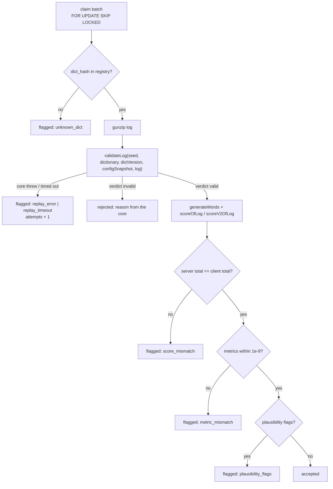

# TypeMore Replay Worker

The worker that turns a `pending` run into `accepted`, `flagged`, or `rejected`.
It is the reason run ingestion is allowed to be dumb: `POST /runs` stores an
opaque log and answers immediately (`docs/RUNS.md`), and everything that decides
whether the run is *real* happens here, out of band.

**One rule governs this package: no core logic is reimplemented in Go.** Words,
metrics, score, and the validation verdict all come from the vendored TypeScript
core running in goja (`internal/replay/corejs`, ARCHITECTURE.md §4.2,
BACKEND.md §1). Go orchestrates; it never computes. A Go FNV-1a, a Go WPM
formula, or a Go "close enough" comparison would defeat the entire design.

## Pipeline



Per run, in order:

1. **Resolve the dictionary** by `dict_hash` from the registry
   (`docs/DICTIONARIES.md`). An unknown hash is flagged, never rejected — the run
   may simply predate a dictionary rotation, which is the server's problem, not
   the player's.
2. **Regenerate the words** from `(seed, dictVersion, setup.generation)` with
   `generateWords`. Same seed + same dictionary ⇒ the exact text the client
   played.
3. **Validate** with `validateLog({ seed, dictionary, dictVersion,
   configSnapshot: setup.config, log })`. This is the core's own server-side
   entry point: structural rules (log version, contiguous `seq`, monotonic `t`),
   the two-clock deadline check, a full reducer replay, the MinSpeed tail, then
   the plausibility flags. It also returns the **server's metrics**.
4. **Recompute the score**, routed by the run's `score_version`:
   `scoreOfLog(events, {config, words})` for v1, and
   `scoreV2OfLog(events, {config, words, generation}, declaration)` for v2 —
   v2 additionally derives the mod multiplier from the setup (verifiable mods)
   and the declaration (view-only mods, accepted on trust).
5. **Compare** and decide (below).

`generateWords` runs twice per valid run — once inside `validateLog`, once for
the score context. That is deliberate: the alternative is a core entry point that
returns its internal words, i.e. editing the client's core to suit the server.
Generation is linear and cheap next to folding the log.

## Decision table

| Condition | Status | `validation.reason` | `attempts` |
|---|---|---|---|
| `dict_hash` not in the registry | `flagged` | `unknown_dict` | unchanged |
| core call exceeded the interrupt budget | `flagged` | `replay_timeout` | +1 |
| core threw, or returned something undecodable | `flagged` | `replay_error` | +1 |
| `validateLog` verdict `invalid` | `rejected` | the core's own reason | unchanged |
| server score total ≠ client score total | `flagged` | `score_mismatch` | unchanged |
| a client metric differs by > 1e-9 | `flagged` | `metric_mismatch` | unchanged |
| plausibility flags raised | `flagged` | `plausibility_flags` | unchanged |
| none of the above | `accepted` | *(absent)* | unchanged |

Precedence is top to bottom. An **invalid log outranks a mismatch**: numbers
recomputed from a log the reducer refused are meaningless, so they are not
stored at all (`server_metrics` / `server_score` stay NULL).

`bundle_sha` is recorded on **every** decision, including the failures.

### Why the score comparison has no epsilon

The client's total and the server's both come out of a single `Math.round` in
the same bundle, over the same doubles. If they differ **at all**, two different
codes ran — a stale client, an edited number, or a bundle the server did not
expect. An epsilon there would hide exactly the drift this worker exists to
detect, so `score_mismatch` is `!=`, full stop.

Metrics get `1e-9` because they travel a longer road: the client's
`wpm`/`raw`/`acc` are serialised, stored as `jsonb`, and read back, while the
server's come straight out of the runtime. The tolerance covers the last bits of
that round trip and nothing more — the tampering test nudges a metric by `1e-6`
and is flagged.

### What the flags mean

`validation.flags[]` is the core's own scored anti-cheat output
(`shared/core/validate.ts`): `multi-grapheme-insert`, `paste`, `min-interval`,
`uniform-intervals`, `zero-variance`, `superhuman-burst`, `afk-heavy`,
`trailing-afk`. Each carries a severity in `[0, 1]` and a human detail string.
They never invalidate a run on their own — they route it to review.

## Storage

`00004_replay.sql` adds to `runs`:

| Column | Meaning |
|---|---|
| `server_metrics` | The core's recomputed `Metrics`, verbatim |
| `server_score` | The core's recomputed `ScoreResult`, verbatim |
| `validation` | `{verdict, reason?, flags[], divergence?}` |
| `bundle_sha` | SHA-256 of the bundle that produced the numbers |
| `validated_at` | When the verdict was written |
| `attempts` | Failed replays so far (timeout / core error only) |
| `last_error` | The last failure, for operator triage |

`verdict` is the core's `valid` / `invalid`, or the server's own `error` when the
run could not be replayed at all. `divergence` names the first field that
disagreed and carries **both** numbers, so a reviewer never has to re-run
anything:

```json
{
  "verdict": "valid",
  "reason": "score_mismatch",
  "flags": [],
  "divergence": { "field": "total", "client": 5640, "server": 1410 }
}
```

**`client_metrics` and `client_score` are never overwritten.** The pair — what
the client claimed and what the server computed — *is* the evidence, and a
rebalance or an appeal needs both.

## The queue: `FOR UPDATE SKIP LOCKED`, not river

BACKEND.md §0 lists river as the job queue. **This phase deliberately deviates**
and uses a plain transactional claim:

```sql
SELECT ... FROM runs
WHERE status = 'pending'
ORDER BY created_at
FOR UPDATE SKIP LOCKED
LIMIT $1;
```

Why:

- **One job type, one source of work.** The queue is a column on a table we
  already own and already index (`runs_pending_idx`). River would add a
  dependency, its own tables, and a second migration lineage to buy scheduling
  features nothing here needs.
- **No `processing` status to reconcile.** The claim, every decision, and the
  commit live in ONE transaction. A worker that crashes, is killed, or loses its
  connection rolls straight back to `pending` — there is no half-state and no
  janitor to write.
- **Horizontal scaling is free.** `SKIP LOCKED` steps over rows another worker
  holds, so N workers share the queue with no coordination. The concurrency test
  drives two workers over one queue and asserts every run is judged exactly once.

The cost is transaction duration: the row locks are held for the whole batch,
bounded by `batchSize × replayTimeout` (default 20 × 5 s worst case, milliseconds
in practice). If that ever becomes a problem the fix is a smaller batch, not a
broker. River remains the right answer the day there are scheduled jobs (the
daily challenge, nightly rebalances) — this is not that day.

## Runtime model

- **One `goja.Runtime` per worker goroutine, never shared.** A runtime is not
  goroutine-safe; each worker builds its own `Core` at startup, so a broken
  bundle fails the worker instead of surprising a run.
- **The bundle is evaluated once per runtime**, and parsed dictionaries are
  cached per runtime by hash — a 20 KB word list is parsed once, not once per
  run.
- **Every core call is wrapped in a context-driven `goja.Interrupt`**
  (`TYPEMORE_REPLAY_TIMEOUT`, default 5 s). A watchdog goroutine flips the
  interrupt flag on the deadline and is fully retired before the flag is
  cleared, so a timeout can never leak into the next call — there is a test for
  exactly that.
- **JS exceptions become Go errors, never panics.** A `throw` arrives as
  `*goja.Exception`, an interrupt as `ErrReplayTimeout`, and an interpreter-level
  panic is recovered into an error. `decide` is total: every one of them produces
  a decision, so a poisonous run costs one timeout and the loop keeps going.

## Lifecycle

Started from `cmd/server` and drained on shutdown: the deferred `WaitGroup.Wait`
runs after the HTTP server stops and before the pool closes, so an in-flight
batch still has a database to commit to. A batch that has already claimed rows
runs on an **uncancelled** context (bounded by `REPLAY_SHUTDOWN_GRACE`) — the
point of graceful shutdown is that finished work commits rather than rolls back.

| Variable | Default | Meaning |
|---|---|---|
| `TYPEMORE_REPLAY_ENABLED` | `true` | Turn the worker off for an API-only replica |
| `TYPEMORE_REPLAY_POLL_INTERVAL` | `2s` | Wait after an **empty** batch; a full batch is followed immediately, so a backlog drains at full speed |
| `TYPEMORE_REPLAY_BATCH_SIZE` | `20` | Runs per transaction (and therefore lock-hold time) |
| `TYPEMORE_REPLAY_CONCURRENCY` | `1` | Worker goroutines, each with its own goja runtime |
| `TYPEMORE_REPLAY_TIMEOUT` | `5s` | Interrupt budget for one core call |
| `TYPEMORE_REPLAY_SHUTDOWN_GRACE` | `30s` | Ceiling on finishing an in-flight batch |

Each batch logs one line: `{claimed, accepted, flagged, rejected, failed, tookMs}`.

## Updating the core bundle

The bundle is a published artefact in the same sense a dictionary is: runs are
judged by it, and the verdict is only meaningful with the `bundle_sha` beside it.

1. `make core-bundle` (see `internal/replay/corejs/README.md`).
2. `go test ./internal/replay/`. `TestPublishedHashesAreImmutable` guards the
   dictionaries; `TestGoldenVectorsReplayBitExact` guards the scoring contract.
3. **If a golden vector's expectation moved, stop.** It means the new bundle
   scores differently from the one that judged every already-accepted run. That
   is a scoring-formula change, and the core's own version discipline applies
   (`SCORING_CONCEPT.md` §7.6): add `scoreV3` alongside, never edit a version in
   place. Regenerate the vectors (`node internal/replay/testdata/generate.mjs`)
   only once you have decided the change is intended, and read the diff.
4. Runs already judged are **not** re-judged automatically. A rebalance is a
   deliberate batch: `UPDATE runs SET status='pending' WHERE bundle_sha = '<old>'`
   and let the worker drain them.

## Deliberately still deferred

- **Anti-cheat beyond the core's flags** — cross-run heuristics, device
  fingerprint correlation, shadow-ban (BACKEND.md §11).
- **The admin review queue** over `flagged` runs.
- **Leaderboards and TP** — an `accepted` run does not yet update any read model
  (SCORING_CONCEPT §4–5).
- **Automatic retry of `replay_timeout` / `replay_error` runs.** `attempts` is
  recorded but nothing re-queues them; today that is an operator's `UPDATE`.

## Related

- `docs/RUNS.md` — ingestion, the payload, and what it deliberately does not check
- `docs/DICTIONARIES.md` — the registry the worker resolves `dict_hash` against
- `internal/replay/corejs/README.md` — the vendored bundle and how to rebuild it
- `internal/replay/testdata/README.md` — how the golden vectors are produced
- `ARCHITECTURE.md` §4.2, BACKEND.md §1, §3 — why replay runs the client's code
