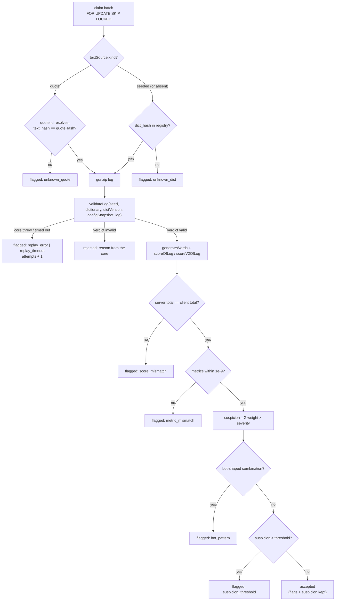

# TypeMore Replay Worker

The worker that turns a `pending` run into `accepted`, `flagged`, or `rejected`.
It is the reason run ingestion is allowed to be dumb: `POST /runs` stores an
opaque log and answers immediately (`docs/RUNS.md`), and everything that decides
whether the run is *real* happens here, out of band.

**One rule governs this package: no core logic is reimplemented in Go.** Words,
metrics, score, and the validation verdict all come from the vendored TypeScript
core running in goja (`internal/replay/corejs`, ARCHITECTURE.md §4.2,
BACKEND.md §1). Go orchestrates; it never computes. A Go FNV-1a, a Go WPM
formula, or a Go "close enough" comparison would defeat the entire design.

## Pipeline



Per run, in order:

1. **Resolve the text source.** A run whose `setup.generation.textSource.kind`
   is `quote` gets its words from the **quote registry**, by id, superseded
   revisions included — a run played on a since-retired revision must replay
   forever. The registry's `text_hash` is checked against the run's `quoteHash`,
   and the resolved bytes are injected into the generation config handed to
   goja. The client's copy of the text is never involved: it is refused at
   ingestion, and it would be overwritten here regardless. An unknown id or a
   hash disagreement is flagged `unknown_quote`, never rejected.

   Everything else is a **seeded** run — including the legacy shape, where
   `textSource` is absent entirely. It resolves its **dictionary** by `dict_hash`
   from the registry (`docs/DICTIONARIES.md`); an unknown hash is flagged, never
   rejected, because the run may simply predate a dictionary rotation, which is
   the server's problem, not the player's.

   The two paths are exclusive, and that is load-bearing: a quote run's
   `dict_hash` is `dictVersion([text])` and resolves to **no** dictionary, so a
   shared lookup would flag every quote run `unknown_dict` before it reached the
   quote resolver. `internal/replay` does not import `internal/quote` — it
   declares a narrow `QuoteResolver` at the consumer, exactly as it declares
   `Projector`, and the composition root wires
   `quote.ReplayResolver{Store: …}` into it.
2. **Regenerate the words** from `(seed, dictVersion, setup.generation)` with
   `generateWords`. Same seed + same dictionary ⇒ the exact text the client
   played. For a quote run the same call takes a different branch: it splits the
   injected text on `' '`, drops the empties, consumes no PRNG, and checks
   `dictVersion([text])` against the context — which the server has already made
   true, so the check is the core's belt to the server's braces.
3. **Validate** with `validateLog({ seed, dictionary, dictVersion,
   configSnapshot: setup.config, log })`. This is the core's own server-side
   entry point: structural rules (log version, contiguous `seq`, monotonic `t`),
   the two-clock deadline check, a full reducer replay, the MinSpeed tail, then
   the plausibility flags. It also returns the **server's metrics**.
4. **Recompute the score**, routed by the run's `score_version`:
   `scoreOfLog(events, {config, words})` for v1, and
   `scoreV2OfLog(events, {config, words, generation}, declaration)` for v2 —
   v2 additionally derives the mod multiplier from the setup (verifiable mods)
   and the declaration (view-only mods, accepted on trust).
5. **Compare** and decide (below).

`generateWords` runs twice per valid run — once inside `validateLog`, once for
the score context. That is deliberate: the alternative is a core entry point that
returns its internal words, i.e. editing the client's core to suit the server.
Generation is linear and cheap next to folding the log.

A quote's text, by contrast, is resolved **once per run**, before the core is
entered, and injected onto the single parsed object both `generateWords` calls
read their generation config from. Resolving per call would mean two registry
reads that a concurrent re-import could answer differently — one run judged
against two texts.

## Decision table

| Condition | Status | `validation.reason` | `attempts` |
|---|---|---|---|
| `dict_hash` not in the registry | `flagged` | `unknown_dict` | unchanged |
| quote id unknown, or its `text_hash` ≠ the run's `quoteHash` | `flagged` | `unknown_quote` | unchanged |
| core call exceeded the interrupt budget | `flagged` | `replay_timeout` | +1 |
| core threw, or returned something undecodable | `flagged` | `replay_error` | +1 |
| `validateLog` verdict `invalid` | `rejected` | the core's own reason | unchanged |
| server score total ≠ client score total | `flagged` | `score_mismatch` | unchanged |
| a client metric differs by > 1e-9 | `flagged` | `metric_mismatch` | unchanged |
| a bot-shaped flag combination fired | `flagged` | `bot_pattern` | unchanged |
| suspicion ≥ review threshold | `flagged` | `suspicion_threshold` | unchanged |
| none of the above | `accepted` | *(absent)* | unchanged |

Precedence is top to bottom. An **invalid log outranks a mismatch**: numbers
recomputed from a log the reducer refused are meaningless, so they are not
stored at all (`server_metrics` / `server_score` stay NULL).

`bundle_sha` and `policy_version` are recorded on **every** decision, including
the failures.

Note what is **not** in the table: *"a plausibility flag was raised"*. A single
weak flag never sends a run to review — see [Review policy](#review-policy).

### Why the score comparison has no epsilon

The client's total and the server's both come out of a single `Math.round` in
the same bundle, over the same doubles. If they differ **at all**, two different
codes ran — a stale client, an edited number, or a bundle the server did not
expect. An epsilon there would hide exactly the drift this worker exists to
detect, so `score_mismatch` is `!=`, full stop.

Metrics get `1e-9` because they travel a longer road: the client's
`wpm`/`raw`/`acc` are serialised, stored as `jsonb`, and read back, while the
server's come straight out of the runtime. The tolerance covers the last bits of
that round trip and nothing more — the tampering test nudges a metric by `1e-6`
and is flagged.

## Review policy

`validateLog` emits scored plausibility flags (`shared/core/validate.ts`):
`multi-grapheme-insert`, `paste`, `min-interval`, `uniform-intervals`,
`zero-variance`, `superhuman-burst`, `afk-heavy`, `trailing-afk`, and — on log
v2 only — `unpaired-keyup`. Each carries a severity in `[0, 1]` and a human
detail string.

**These are signals, not verdicts.** The policy is what turns them into a
status, and it exists because the obvious rule does not work.

> **The policy is optional and lives behind an interface.** Everything below
> this line describes the review policy — what a flag is worth, where the review
> threshold sits, which combinations are shapes. It is compiled in only under
> `-tags anticheat`. The open default (`policy.Noop`) computes no suspicion and
> routes nothing to review, and the server still replays every run, still
> recompares every number, and still refuses everything the hard rules refuse.
>
> The worker talks to `policy.Judge` and to nothing else. **No hard verdict
> depends on it** — `TestHardVerdictsDoNotDependOnTheJudge` runs the tamper
> matrix against judges from "review nothing, ever" to "review everything" and
> gets identical verdicts. See [SELF_HOST.md](./SELF_HOST.md) for what an
> instance without a policy does and does not protect.

### What was wrong with "any flag ⇒ flagged"

The first version of this worker flagged a run whenever `len(flags) > 0`. On the
first 23 real runs that produced 11 flagged, of which **10 were noise**:

- 8 × `min-interval` at severity ≈ 0.02 — one or two keystroke intervals under
  15 ms out of 70–98. That is ordinary key rollover, not a machine.
- 2 × `afk-heavy` at 0.80–0.93 — abandoned runs, already punished by their own
  score.

A queue that is 90% rollover is a queue nobody reads, which means the one
genuinely interesting run in it never gets looked at. The severity the core
already computes was being thrown away.

### Weights

Suspicion is `Σ weight[code] × severity`. A weight is what a *maximally severe*
instance of that flag is worth, so the table reads as "how much review does this
signal deserve at its worst". Defaults live in `internal/replay/policy/review_anticheat.go` (built only under `-tags anticheat`);
`make calibrate` is how they were chosen.

| Flag | Weight | Why |
|---|---|---|
| `zero-variance` | 1.00 | Every interval identical to the millisecond. A hand cannot do this. |
| `uniform-intervals` | 0.90 | ≥90% of intervals within ±2 ms of the mean. Same signal, slightly softer — a metronome-steady typist is rare, not impossible. |
| `superhuman-burst` | 0.80 | Above the WPM ceiling at flawless accuracy. Severity is a ratio against 2× the ceiling, so a short genuine burst stays well under the threshold. |
| `paste` | 0.80 | Text that arrived without being typed. Unambiguous, but severity is pastes/events, so one paste in a long log stays small. |
| `multi-grapheme-insert` | 0.50 | More than one grapheme per event. Usually an IME or a mobile keyboard, occasionally automation. |
| `min-interval` | 0.30 | Intervals under 15 ms. **The false-positive generator.** One or two in a hundred is rollover; a log where most intervals are impossible also trips `superhuman-burst`, and the two together clear the bar. |
| `afk-heavy` | 0.02 | See below. |
| `trailing-afk` | 0.02 | See below. |
| `unpaired-keyup` | 0.00 | Telemetry. See below. |

**Review threshold: `1.00`** — one maximally severe strong flag, or a believable
combination of weaker ones. On real data the worst run scores `0.027`, two
orders of magnitude below it; the bot-shaped fixture scores `1.90`.

### Why AFK is worth almost nothing

**An idle or abandoned run is a bad run, not a suspicious one.** The duration
keeps running, WPM collapses, and the result is a bad result — there is no
advantage to be gained by walking away from the keyboard, so idleness is not an
anti-cheat signal at all. It is a shape of play.

The flags are still recorded on every run: "how many runs get abandoned" is a
real product question, and a moderator looking at a specific run wants to know.
They simply do not route to review. The weight is deliberately non-zero rather
than zero so a run that is *both* mostly idle *and* otherwise suspicious still
tips a little further.

A maximally idle run (`afk-heavy` 1.0 + `trailing-afk` 1.0) scores `0.04`
against a `1.00` threshold — pinned by `TestAfkFlagsDoNotReachReview`.

### Why telemetry is worth exactly nothing

Log v2 carries keyboard telemetry, and the phase decision for it is **a
structural layer only**: the log's own grammar is enforced, and nothing is
scored. `unpaired-keyup` — a key release with no preceding press — is the one
flag the core raises off that layer, and its weight is `0.00`.

Not "small like AFK", but exactly zero, and for a different reason. An unpaired
release is what an honest player produces all day: alt-tab with a key held, a
layout switch mid-word, a window that loses focus, a key held across the start of
the log. AFK gets a token weight because it is at least a real (if useless)
signal; this is not a signal yet. There is **no calibration data for v2 at all**,
so any weight on it would be a guess, and a guess here lands on real players.

The flag is still raised, still stored on every decision, and still visible to
moderation — it is telemetry, not silence. Judging it starts by removing the code
from `TelemetryOnlyFlags` deliberately, with population numbers from `make
calibrate` to justify the weight. Until then the zero is pinned by
`TestTelemetryFlagsAreCollectedNotJudged`, and
`TestUnpairedKeyupsAreAcceptedAtAnyCount` replays a real log with 1, 5 and 50
unpaired releases: identical score, identical metrics, identical suspicion,
accepted with the flag kept.

### Combination rules

Some shapes are suspicious even when no single severity is large. These bypass
the threshold entirely: they are shapes, not magnitudes, so **no amount of
weight tuning can hide them** (`TestBotCadenceFiresEvenWithZeroWeights`).

| Rule | Fires when | Why |
|---|---|---|
| `bot_cadence` | `uniform-intervals` **and** `zero-variance` both present | Machine timing. The two reinforce rather than repeat each other: uniformity is a ratio, variance is absolute. |
| `sustained_superhuman` | `superhuman-burst` present **and** `metrics.durationSec ≥ 10 s` | A two-second flurry above the ceiling is rollover or a short sample. Ten seconds of it is a claim that needs a human. |

The duration floor reads the **server's** own `durationSec`. Unreadable metrics
make the rule abstain rather than fire on a guess.

### Accepted runs keep their flags

An `accepted` run stores its flags, its suspicion and the threshold it was
compared against. Moderation can ask "show me accepted runs above 0.5 suspicion"
without re-running anything, and a future tightening has the evidence it needs
already on disk. None of it is exposed to the player — `docs/RUNS.md` lists the
summary fields the client sees.

### Tuning

| Variable | Default | Meaning |
|---|---|---|
| `TYPEMORE_REPLAY_FLAG_WEIGHTS` | *(unset)* | Per-code overrides, `code=weight,code=weight`. Unlisted codes keep their default. |
| `TYPEMORE_REPLAY_REVIEW_THRESHOLD` | `1.0` | Suspicion at or above which a run is flagged. |
| `TYPEMORE_REPLAY_SUSTAINED_BURST_SEC` | `10` | Duration floor for `sustained_superhuman`. |

All three tune a policy that must already be **built in**. On a binary without
`-tags anticheat` they have nothing to tune, and the server warns rather than
ignoring them. They are build-gated rather than runtime-gated on purpose: a
runtime switch leaves the weights and the rule names in the binary whichever way
it is set, and `strings` reads them in ten seconds.

Tuning does **not** move `policy_version`. A version that shifted with every
nudged weight would make `revalidate` re-judge the whole table on each one; the
effective threshold is recorded in each verdict's audit block instead, which is
what explains a verdict on a tuned instance.

An unknown flag code or an unparseable weight is a **startup error**. A typo in
a tuning knob must stop the process, not leave a check that looks configured and
is not.

Because the weights are tunable, `policy_version` alone would not explain a
verdict on a server running an override — so the effective suspicion and
threshold are stored on the row as well.

#### What has to be measured before the next weights move

Every weight in the table is either calibrated against a real population or
explicitly parked at a number that says "no data yet". The parked ones are the
work list, and this is what has to be brought to it. **Whoever proposes the next
weight change owns producing these numbers first** — a weight set without them
is a guess that lands on real players.

**1. The IME baseline — measured 2026-08-03, and now the input to a new flag.**

Over the 138-run export of that date, characters that reached the buffer through
an `ime` replace rather than a keystroke:

| | value |
|---|---|
| share of all typed characters | **0.4 %** (101 of 22 905) |
| runs carrying any ime replace | **7 of 138** (5.1 %) |
| per-run share on those seven | 0.5 % – 19.8 % |
| composition sessions | **0** |
| soft-keyboard word commits | 24, every one carrying a trailing space |

Read carefully, because two of those rows are about a bug rather than a
population. Every ime replace in this export is a soft-keyboard word commit, and
they are all shaped the way the pre-fix input adapter shaped them (a caret-width
range carrying the keyboard's own trailing space). That adapter has since been
fixed, so a re-export will not be comparable event for event: the SHARE is the
durable figure, the shape is not.

The proposal this baseline exists for is a scored flag on **the share of a run's
text that arrived as an ime replace**. The case for it is that a real mobile run
sits in the single digits and a run typed by feeding whole words through
`insertText` is at or near 100 %, so the two are separable by a wide margin. The
case against shipping it untuned is this same table: one honest run is already at
19.8 %, so any threshold below about a third would land on a person with a
predictive keyboard. It needs a mobile population — this export has essentially
none — before it gets a weight above zero.

**2. Kent's cheapest remaining vector is now "type the run in whole words."**

The canary work closed reading the text off the screen. It did not close writing
it back in: a `replace` with `source: 'ime'` is indistinguishable from a phone
keyboard committing a suggestion, and `multi-grapheme-insert` (weight 0.50) only
counts multi-grapheme **inserts**, not replaces. A scraper that emits one replace
per word therefore raises nothing that costs it anything. That is the target to
build against, and the ime-share flag above is the answer being calibrated for
it.

**3. `unpaired-keyup` has its first real evidence, and it is not enough yet.**

Weight 0.00 by contract (`TelemetryOnlyFlags`), on the argument that there was no
v2 calibration data at all. There is now a little: on the same export the flag
fires on **81.8 %** of the confirmed cheating account's runs against **25.2 %** of
everyone else's — a 3.2× enrichment. That is a signal, and eleven runs from one
account is not a population. It stays at zero until a second confirmed account
reproduces the enrichment, and the number to beat is written down here so the
next person does not have to rediscover it.

**4. What `calibrate` must be re-run against.**

The v4 core changed which runs raise `superhuman-burst` (it is no longer gated on
flawless accuracy, and its ceiling now falls with the run's duration). Every
distribution recorded before that — including the ones in this section — was
measured through the old detector. Re-run `make calibrate` after the v4 deploy and
its revalidate pass, and treat the fresh baseline as the input to any weight
change, not the ones above.

### Policy versioning

A judge's `Version()` identifies its rule set. Bump it whenever weights, the
threshold, or combination rules change in a way that would re-judge an
already-judged run, then run `make revalidate`.

It is a **string** on the interface and a smallint in the column, and
`policy.ParseVersion` is the single place that maps one to the other — resolved
once when the worker is built, so a judge with an unstorable version is a startup
failure rather than a surprise on some run at three in the morning.

`policy.Noop` reports `"none"`, which stores as **NULL** — the value the column
already used for "no rule set judged this run". A run judged without a policy
therefore carries no version AND no `policy` block in its `validation`, which is
not the same as a block full of zeroes: zeroes would read as "a policy looked and
found nothing", and the truth is that nothing looked.

That is what makes enabling a policy retroactively possible at all. The claim
below already keys on `policy_version IS NULL`, so an instance that turns
anti-cheat on and runs `revalidate` re-judges its entire unjudged history without
anyone having to remember which runs those were.

`bundle_sha` and `policy_version` answer different questions and move
independently:

- **`bundle_sha`** — which code produced the numbers. Changes when the core
  bundle is re-vendored.
- **`policy_version`** — which rules turned those numbers into a status. Changes
  when the table above changes; the numbers are untouched.

`policy_version IS NULL` means the run was judged before the policy existed
(the original "any flag ⇒ flagged" rule).

### Canary epoch

Two flags — `canary-grapheme` and `canary-commit` — are only raised for runs the
worker judges with the core's canary detectors **armed**, and arming is decided
per run by one comparison:

```
armed = epoch is set AND run.created_at >= epoch
```

`TYPEMORE_REPLAY_CANARY_EPOCH` (RFC3339) is that epoch, it is **unset by
default**, and unset arms nothing at all — no run, at any age.

That gate is not caution, it is correctness. The canary schedule is a pure
function of a run's **seed**, so it is computable for every run ever stored,
including the entire archive submitted by clients that never drew a canary. An
ungated judge would score those runs' coincidental early commits as evidence —
and `make revalidate` walks all of history in one pass, so it would do it to
every stored run at once.

The epoch is therefore set **by hand, once, after the rendering client is
deployed** — not by a default, not by a migration:

1. Ship the core + this server with the epoch unset. Everything is inert:
   `validateLog` is bit-identical to its pre-canary self, and the golden vectors
   prove it.
2. Deploy the frontend that renders canaries.
3. Set `TYPEMORE_REPLAY_CANARY_EPOCH` to that deploy instant and restart.

Runs created before the epoch keep being judged exactly as they always were, so
step 3 is safe to combine with a `revalidate` pass — and a pre-epoch run
re-judged afterwards produces a bit-identical verdict
(`TestAPreEpochRunIsJudgedBitIdenticallyToNoEpochAtAll`).

Note what the epoch does **not** move: `policy_version`. The rules changed when
the two flags got weights (v2 → v3); the epoch decides which runs those rules
can ever see a canary flag on. Both matter, and they are set in different
places for the same reason `bundle_sha` and `policy_version` are two columns.

## Tooling

### `make calibrate` — dry run, writes nothing

Re-validates stored runs through the current bundle **and** the current policy,
then prints what it finds: per-flag firing rate with min/mean/max severity and
the maximum contribution each flag can make, a suspicion histogram, the worst
offenders with their flags, and the status changes the policy would apply. Run
it before touching a weight.

It judges through `replay.Judge` — the exact function the worker calls — so the
report cannot disagree with what revalidation would do.

### `make revalidate` — bounded, idempotent

Re-judges runs that are no longer current on **either** axis, claiming them with
the same `FOR UPDATE SKIP LOCKED` discipline as the queue so it can run while
the worker is live:

```sql
FROM runs r
JOIN run_verdicts v ON v.run_id = r.id      -- the join IS the "judged" filter
WHERE v.policy_version IS NULL              -- judged before the policy existed
   OR v.policy_version < @policy_version    -- the RULES moved
   OR v.bundle_sha IS DISTINCT FROM @bundle_sha  -- the CODE moved
```

It re-runs the **full replay**, not just the scoring rules, so a claimed run is
re-scored by the bundle that is vendored now.

**The bundle arm is not optional, and it used to be missing.** Keying on
`policy_version` alone stranded exactly the runs a re-vendored core creates: the
client computes with new code, the stored numbers came from old code, the
comparison says `metric_mismatch` — and a policy-only claim declines to look,
because the rules never moved. Fourteen real runs sat in that state
(`docs/PERFORMANCE.md`, "the vendored bundle is stale"). `IS DISTINCT FROM`
rather than `<>` so a row predating the column (`bundle_sha IS NULL`) is claimed
instead of being skipped by three-valued logic.

The sha is the one `replay.BundleSHA()` returns — the same value the decision
stamps onto the row — so the claim and the apply cannot drift into two digests
and re-judge the same rows forever.

Idempotent by construction: applying a decision writes **both** `policy_version`
and `bundle_sha`, so a re-judged row stops matching both arms and a second pass
finds nothing (`TestRevalidateIsBoundedAndIdempotent`,
`TestRevalidateClaimsRunsJudgedByAnotherBundle`). Pending runs are never touched
— those belong to the worker.

Both read the same `TYPEMORE_` environment as the server, so they judge with the
deployment's policy, overrides included.

### Unpublished dictionaries

A run whose `dict_hash` is not in the registry is **flagged `unknown_dict`,
never rejected**. The text cannot be regenerated, so the run cannot be judged —
but that is the server's problem (a dictionary was rotated, or a hash was never
published), not evidence against the player. Rejecting it would destroy a
possibly-legitimate result over a deployment detail.

If the dictionary comes back, `make revalidate` re-evaluates the run and it gets
a real verdict. That is the other half of the immutability rule in
`docs/DICTIONARIES.md`: a published `dict_hash` must stay published precisely so
these runs stay judgeable.

### Unresolvable quotes

The same rule, one level down. A run whose `quoteId` the registry does not know,
or whose stored `text_hash` disagrees with the run's `quoteHash`, is **flagged
`unknown_quote`, never rejected**.

The mismatch case is the interesting one, because it looks like tampering and
almost never is. A quote is a published artefact: the importer never issues
`UPDATE … SET text`, it inserts a new revision **beside** the old one and marks
the old one superseded ([`QUOTES.md`](QUOTES.md)). So a `quoteId` whose bytes
have changed under it means something happened to the *corpus* — a hand-edited
row, a restore from a stale dump, a node the re-import has not reached. The run
may be perfectly honest and simply unjudgeable right now.

That asymmetry is the whole argument. A wrong `flagged` costs a human one look
at a review queue and is undone by `make revalidate`. A wrong `rejected` is the
one verdict that says "we proved this was bad", and it is not walked back by
anything. When the evidence points at our own corpus, we do not spend it.

Note also what does **not** produce this reason: a registry that fails to
*answer*. A database that is down is not a missing quote, so a resolver error
falls through to `replay_error` with `attempts + 1` — retryable — instead of
permanently flagging every quote run submitted during an outage.

A superseded revision resolves normally and always will. `/quotes/{id}` serves
retired rows precisely so that every run recorded against one stays judgeable
and watchable forever — the quote-level restatement of the frozen `dict_hash`
rule above.

## Storage

The verdict payload lives in `run_verdicts`, a 1:1 satellite of `runs`
(`00019_run_verdicts.sql`; the columns started life on `runs` in
`00004_replay.sql` / `00005_replay_policy.sql`). A row exists **iff** the run
has been judged — "pending" is the absence of a verdict row, and the
"a decision writes everything at once" invariant is structural rather than
conventional:

| `run_verdicts` column | Meaning |
|---|---|
| `run_id` | PK, FK to `runs` — one verdict identity per run, rewritten in place by revalidation |
| `user_id` | Denormalized snapshot of `runs.user_id` (immutable), indexed — the player-scoped access path the profile aggregates plan through |
| `server_metrics` | The core's recomputed `Metrics`, verbatim (NULL only for `error` verdicts) |
| `server_score` | The core's recomputed `ScoreResult`, verbatim (same) |
| `validation` | `{verdict, reason?, flags[], policy{}, divergence?}` — NOT NULL |
| `bundle_sha` | SHA-256 of the bundle that produced the numbers |
| `policy_version` | The rule set that turned them into a status (NULL = pre-policy) |
| `validated_at` | When the verdict was written — NOT NULL |

What stays on `runs` is the run's own lifecycle and the queue's mechanics —
`status` (the partial index `runs_pending_idx` and every accepted-only read key
on it), `attempts` (failed replays so far: timeout / core error only) and
`last_error` (the last failure, for operator triage). The worker writes the two
tables back to back in the claim's transaction, so the pair commits or rolls
back as one fact.

`verdict` is the core's `valid` / `invalid`, or the server's own `error` when the
run could not be replayed at all. `divergence` names the first field that
disagreed and carries **both** numbers, and `policy` is the arithmetic behind
the status — so a reviewer never has to re-run anything:

```json
{
  "verdict": "valid",
  "reason": "score_mismatch",
  "flags": [],
  "policy": { "version": 1, "suspicion": 0, "threshold": 1 },
  "divergence": { "field": "total", "client": 5640, "server": 1410 }
}
```

An accepted run that raised a weak flag looks like this — note that it is
`accepted` *and* carries the evidence:

```json
{
  "verdict": "valid",
  "flags": [
    { "code": "min-interval", "score": 0.0122, "detail": "1/82 intervals < 15ms" }
  ],
  "policy": { "version": 1, "suspicion": 0.003659, "threshold": 1 }
}
```

`policy.rules` lists any combination rules that fired, and `policy.unknownFlags`
lists flag codes the weights table has no entry for — always empty in a healthy
deployment, non-empty when the bundle has moved ahead of the policy.

**`client_metrics` and `client_score` are never overwritten.** The pair — what
the client claimed and what the server computed — *is* the evidence, and a
rebalance or an appeal needs both.

## The queue: `FOR UPDATE SKIP LOCKED`, not river

BACKEND.md §0 lists river as the job queue. **This phase deliberately deviates**
and uses a plain transactional claim:

```sql
SELECT ... FROM runs
WHERE status = 'pending'
ORDER BY created_at
FOR UPDATE SKIP LOCKED
LIMIT $1;
```

Why:

- **One job type, one source of work.** The queue is a column on a table we
  already own and already index (`runs_pending_idx`). River would add a
  dependency, its own tables, and a second migration lineage to buy scheduling
  features nothing here needs.
- **No `processing` status to reconcile.** The claim, every decision, and the
  commit live in ONE transaction. A worker that crashes, is killed, or loses its
  connection rolls straight back to `pending` — there is no half-state and no
  janitor to write.
- **Horizontal scaling is free.** `SKIP LOCKED` steps over rows another worker
  holds, so N workers share the queue with no coordination. The concurrency test
  drives two workers over one queue and asserts every run is judged exactly once.

The cost is transaction duration: the row locks are held for the whole batch,
bounded by `batchSize × replayTimeout` (default 20 × 5 s worst case, milliseconds
in practice). If that ever becomes a problem the fix is a smaller batch, not a
broker. River remains the right answer the day there are scheduled jobs (the
daily challenge, nightly rebalances) — this is not that day.

## Runtime model

- **One `goja.Runtime` per worker goroutine, never shared.** A runtime is not
  goroutine-safe; each worker builds its own `Core` at startup, so a broken
  bundle fails the worker instead of surprising a run.
- **The bundle is evaluated once per runtime**, and parsed dictionaries are
  cached per runtime by hash — a 20 KB word list is parsed once, not once per
  run.
- **Every core call is wrapped in a context-driven `goja.Interrupt`**
  (`TYPEMORE_REPLAY_TIMEOUT`, default 5 s). A watchdog goroutine flips the
  interrupt flag on the deadline and is fully retired before the flag is
  cleared, so a timeout can never leak into the next call — there is a test for
  exactly that.
- **JS exceptions become Go errors, never panics.** A `throw` arrives as
  `*goja.Exception`, an interrupt as `ErrReplayTimeout`, and an interpreter-level
  panic is recovered into an error. `decide` is total: every one of them produces
  a decision, so a poisonous run costs one timeout and the loop keeps going.

## Lifecycle

Started from `cmd/server` and drained on shutdown: the deferred `WaitGroup.Wait`
runs after the HTTP server stops and before the pool closes, so an in-flight
batch still has a database to commit to. A batch that has already claimed rows
runs on an **uncancelled** context (bounded by `REPLAY_SHUTDOWN_GRACE`) — the
point of graceful shutdown is that finished work commits rather than rolls back.

| Variable | Default | Meaning |
|---|---|---|
| `TYPEMORE_REPLAY_ENABLED` | `true` | Turn the worker off for an API-only replica |
| `TYPEMORE_REPLAY_POLL_INTERVAL` | `2s` | Wait after an **empty** batch; a full batch is followed immediately, so a backlog drains at full speed |
| `TYPEMORE_REPLAY_BATCH_SIZE` | `20` | Runs per transaction (and therefore lock-hold time) |
| `TYPEMORE_REPLAY_CONCURRENCY` | `1` | Worker goroutines, each with its own goja runtime |
| `TYPEMORE_REPLAY_TIMEOUT` | `5s` | Interrupt budget for one core call |
| `TYPEMORE_REPLAY_SHUTDOWN_GRACE` | `30s` | Ceiling on finishing an in-flight batch |

Each batch logs one line: `{claimed, accepted, flagged, rejected, failed, tookMs}`.

## Updating the core bundle

The bundle is a published artefact in the same sense a dictionary is: runs are
judged by it, and the verdict is only meaningful with the `bundle_sha` beside it.

1. `make core-bundle` (see `internal/replay/corejs/README.md`).
2. `go test ./internal/replay/`. `TestPublishedHashesAreImmutable` guards the
   dictionaries; `TestGoldenVectorsReplayBitExact` guards the scoring contract.
3. **If a golden vector's expectation moved, stop.** It means the new bundle
   scores differently from the one that judged every already-accepted run. That
   is a scoring-formula change, and the core's own version discipline applies
   (`SCORING_CONCEPT.md` §7.6): add `scoreV3` alongside, never edit a version in
   place. Regenerate the vectors (`node internal/replay/testdata/generate.mjs`)
   only once you have decided the change is intended, and read the diff.
4. Runs already judged are **not** re-judged automatically. Re-running them
   through the new bundle is what `make revalidate` does — its claim's bundle
   arm (`v.bundle_sha IS DISTINCT FROM <current>`) picks up every run the old
   bundle judged, policy change or not. The emergency requeue, should the
   revalidation path itself be broken, is
   `UPDATE runs SET status='pending' WHERE id IN
   (SELECT run_id FROM run_verdicts WHERE bundle_sha = '<old>')`.

## Changing the review policy

1. `make calibrate` against a database with real runs. Read the firing rates
   and the histogram: a weight change that moves nothing, or moves everything,
   is the wrong change.
2. Edit the weights / threshold / rules in `internal/replay/policy/review_anticheat.go`.
3. Bump `CurrentPolicyVersion`.
4. `make calibrate` again — the "transitions" block at the bottom is the exact
   set of status changes you are about to make. Look at them.
5. `go test ./internal/replay/`. `TestTamperedFixturesStayCaughtUnderThePolicy`
   is the guard that no hard check was weakened;
   `TestSingleWeakFlagIsAcceptedWithTheFlagKept` and `TestBotCadenceIsFlagged`
   pin the two ends of the boundary.
6. `make revalidate` to apply it to history. Runs that change status take their
   leaderboard slots with them — the projector rides the same transaction, so a
   demotion leaves the board and a promotion joins it, atomically.

A policy change never touches a metric or a score. If a number moved, that was
a bundle change and belongs in the section above.

## Deliberately still deferred

- **Anti-cheat beyond the core's flags** — cross-run heuristics, device
  fingerprint correlation, shadow-ban (BACKEND.md §11).
- **The admin review queue** over `flagged` runs. The data it needs is now
  there (`validation.policy.suspicion`, sortable), the UI is not.
- **TP / profile rating** — SCORING_CONCEPT §5, its own phase. Leaderboards are
  no longer deferred: an accepted run of a ranked shape updates its board inside
  the same transaction that writes the verdict ([`LEADERBOARDS.md`](LEADERBOARDS.md)).
- **Automatic retry of `replay_timeout` / `replay_error` runs.** `attempts` is
  recorded but nothing re-queues them; today that is an operator's `UPDATE`,
  or a `make revalidate` after a policy bump.
- **Scheduled revalidation.** `make revalidate` is a deliberate operator action,
  not a cron job — a policy change should be applied by someone who has read the
  calibration output.

## Related

- `docs/RUNS.md` — ingestion, the payload, and what it deliberately does not check
- `docs/DICTIONARIES.md` — the registry the worker resolves `dict_hash` against
- `docs/LEADERBOARDS.md` — the projection an accepted run feeds, and its rebuild
- `internal/replay/corejs/README.md` — the vendored bundle and how to rebuild it
- `internal/replay/testdata/README.md` — how the golden vectors are produced
- `ARCHITECTURE.md` §4.2, BACKEND.md §1, §3 — why replay runs the client's code
